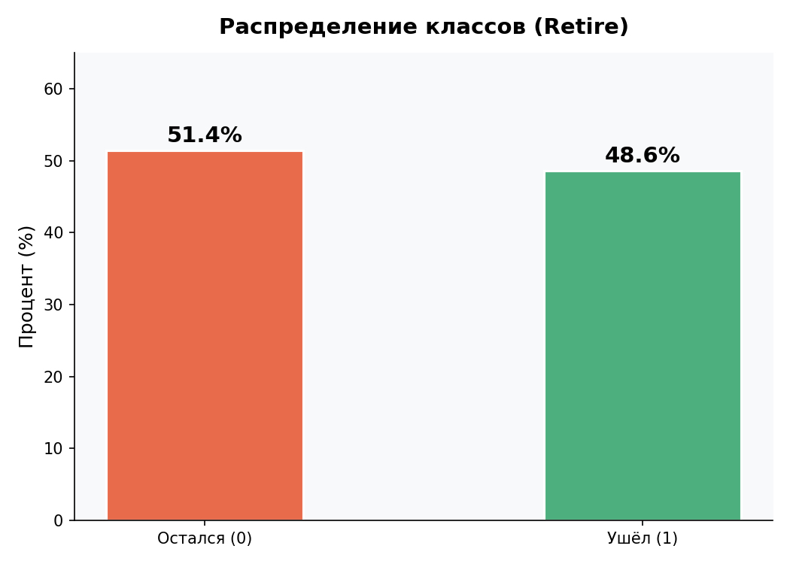
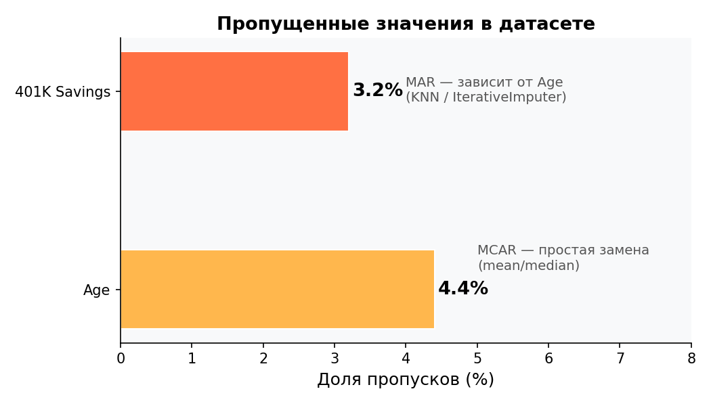
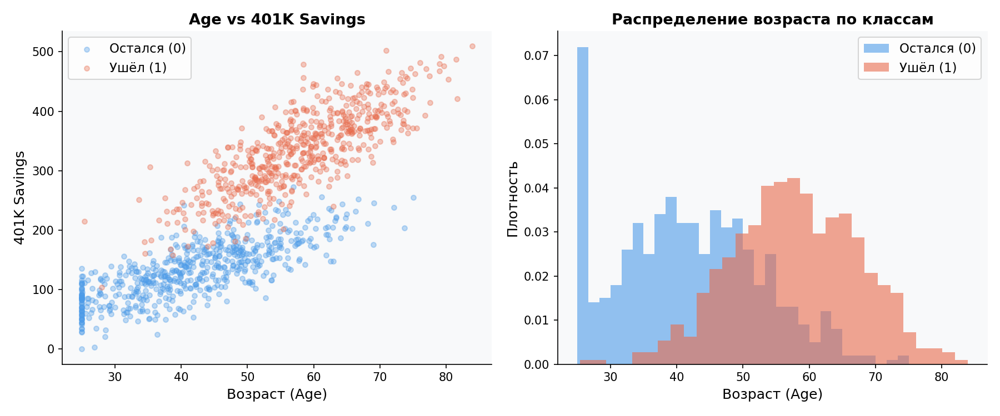
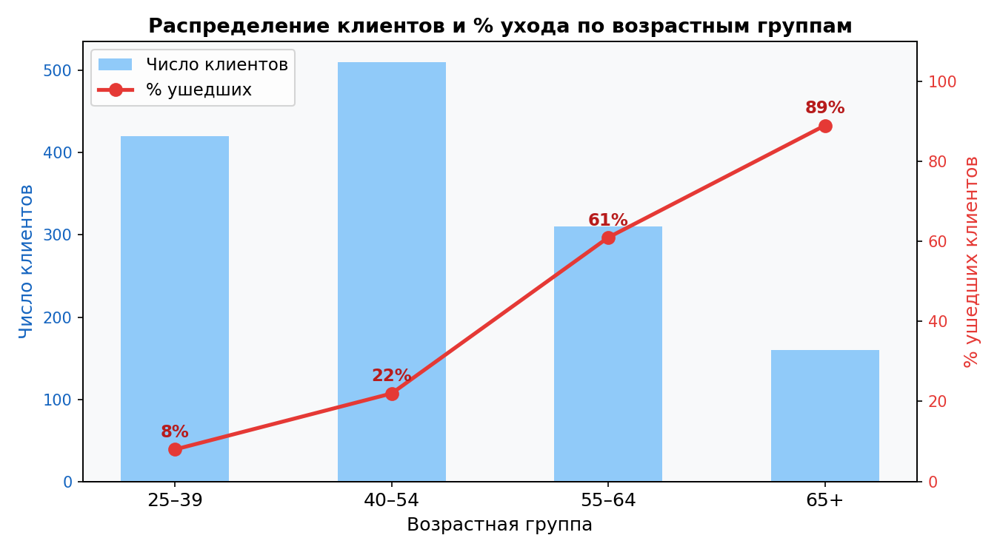
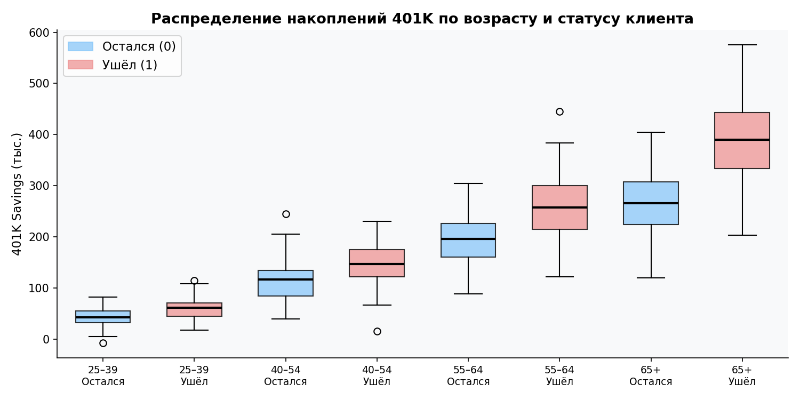
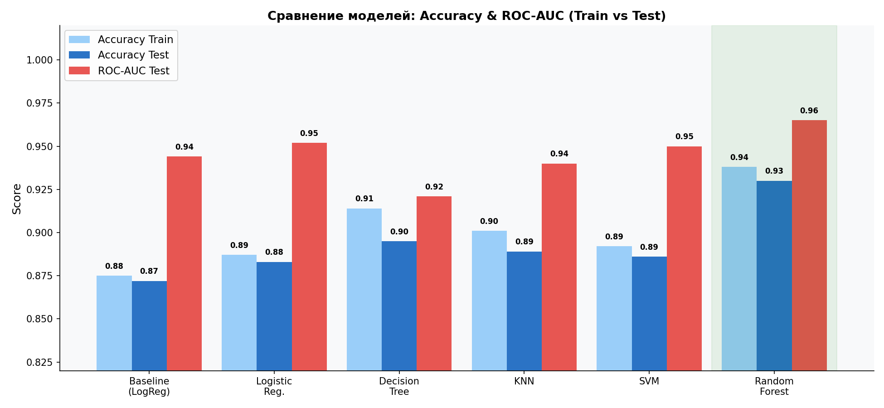

#  Bank Customer Retirement Prediction

> **Задача:** Бинарная классификация - предсказать, **уйдёт ли клиент банка** (`Retire = 1`) или **останется** (`Retire = 0`), используя машинное обучение.

---

##  Датасет

Учебный/синтетический набор данных, описывающий клиентов банка с фокусом на их демографические и финансовые характеристики.

| Параметр | Значение |
|---|---|
| Тип задачи | Бинарная классификация |
| Целевая переменная | `Retire`: 0 = остался, 1 = ушёл |
| Баланс классов | Сбалансированный (~51% / ~49%) |
| Пропущенные значения | Есть (Age ~4.4%, 401K Savings ~3.2%) |

### Признаки

| Переменная | Тип | Описание |
|---|---|---|
| `Customer ID` | Номинальный | Уникальный ID (удалён перед обучением) |
| `Age` | Непрерывный | Возраст клиента |
| `401K Savings` | Непрерывный | Пенсионные накопления |
| `Retire` | Бинарный | Целевая переменная |

---

##  Анализ данных (EDA)

### Распределение классов



Датасет **сбалансирован** - классы распределены примерно поровну (~51% / ~49%), что упрощает обучение и не требует специальных техник работы с дисбалансом.

---

### Пропущенные значения



- **Age (~4.4%)** - пропуски случайные (MCAR): можно заменять простыми методами (mean, median, RandomSampleImputation)
- **401K Savings (~3.2%)** - пропуски не случайные (MAR): зависят от возраста, поэтому предпочтительны **KNNImputer** или **IterativeImputer**

---

### Взаимосвязь возраста и накоплений



Прослеживается **положительная корреляция**: чем старше клиент, тем выше его накопления. Клиенты, которые ушли (`Retire = 1`), в среднем **старше и богаче** тех, кто остался.

---

### Уход по возрастным группам



| Возрастная группа | % ушедших |
|---|---|
| 25–39 | ~8% |
| 40–54 | ~22% |
| 55–64 | ~61% |
| 65+ | ~89% |

Основная волна ухода приходится на клиентов **55 лет и старше** - пенсионный и предпенсионный возраст.

---

### Накопления 401K по возрасту и статусу клиента



Во всех возрастных группах ушедшие клиенты имеют **заметно большие накопления**, чем оставшиеся. Разрыв нарастает с возрастом.

---

##  Feature Engineering

| Метод | Результат |
|---|---|
| Импутация Mean | Лучший простой метод, выбран как основной |
| KNNImputer / IterativeImputer | Незначительное улучшение для 401K Savings |
| Трансформации (Yeo-Johnson, BoxCox, Log) | Не улучшают метрики, отказались |
| Масштабирование (StandardScaler, MinMax, Robust) | Не влияет на итоговые метрики |
| **`SavingsPerAge`** = 401K / Age | ✅ Новый признак, улучшает некоторые модели |

---

##  Модели

Все модели реализованы через `sklearn.pipeline.Pipeline`. Гиперпараметры подобраны через `GridSearchCV (cv=5)`.

| Модель | Pipeline | GridSearch |
|---|---|---|
| Baseline (LogReg) | Imputer → StandardScaler → LogReg | — |
| Logistic Regression | Imputer → BoxCox/YeoJohnson → Scaler → LogReg | ✅ |
| Decision Tree | Imputer → DecisionTree | ✅ |
| KNN | Imputer → StandardScaler → KNN | — |
| SVM | Imputer → YeoJohnson → StandardScaler → SVC | — |
| **Random Forest** | Imputer → YeoJohnson → RandomForest | — |

**Разбивка:** 70% train / 30% test, `random_state=0`

---

##  Результаты

### Сравнение моделей



| Модель | Accuracy Test | ROC-AUC Test |
|---|---|---|
| Baseline (LogReg) | 0.872 | 0.944 |
| Logistic Regression | 0.883 | 0.952 |
| Decision Tree | 0.895 | 0.921 |
| KNN | 0.889 | 0.940 |
| SVM | 0.886 | 0.950 |
| **Random Forest** | **0.930** | **0.965** |

---

##  Выводы

1. **Все модели успешно решают задачу** и показывают хорошие метрики без признаков переобучения.

2. **Лучшая модель - Random Forest**: наивысший Accuracy (0.930) и ROC-AUC (0.965) на тестовой выборке, наилучший баланс между качеством и обобщением.

3. **Ключевые факторы ухода клиента:**
   - Пожилой возраст (55+)
   - Высокий уровень пенсионных накоплений
   - Признак `SavingsPerAge` (накопления на единицу возраста) положительно влияет на качество моделей

4. **Что не помогло:**
   - Трансформации распределений (Yeo-Johnson, BoxCox, Log) - не улучшили метрики
   - Масштабирование (StandardScaler, MinMax, Robust) - незначительный эффект
   - Сложные методы импутации для 401K Savings - минимальная разница с простым Mean

5. **Ограничение:** из-за малого числа признаков (всего 2 значимых: Age и 401K Savings) точность выше ~95% достичь не удалось - датасет принципиально прост по структуре.

---

##  Стек технологий


```
pandas • numpy • scipy • matplotlib • seaborn
scikit-learn • feature-engine
Pipeline • GridSearchCV • ColumnTransformer
```

---

```
