#  Beijing PM2.5 - Прогнозирование загрязнения воздуха

---

## О проекте

Датасет **Beijing PM2.5** от Университета Цинхуа и посольства США - один из самых популярных в мире для задач анализа загрязнения воздуха и прогнозирования временных рядов с помощью LSTM.

**Цель:** предсказать концентрацию мелкодисперсной пыли PM2.5 (μg/m³) по почасовым метеорологическим данным.

- 📅 Период: **2010-01-01 → 2014-12-31** (почти 5 лет непрерывных измерений)
- 📊 Размер: **43 824 строки**, шаг - 1 час, без пропусков по времени
- 🎯 Таргет: `pollution` (концентрация PM2.5, μg/m³)

[Beijing PM2.5 Dataset - UCI / Kaggle](https://www.kaggle.com/datasets/djhavera/beijing-pm25-data-data-set)

---

## Признаки датасета

| Признак | Описание |
|---------|----------|
| `pollution` | PM2.5 - концентрация пыли (таргет) |
| `dew_point` | Точка росы |
| `temperature` | Температура воздуха |
| `pressure` | Атмосферное давление |
| `wind_direction` | Направление ветра (категориальный) |
| `wind_speed` | Скорость ветра |
| `snow` | Кол-во часов со снегом |
| `rain` | Кол-во часов с дождём |

---

##  Разведочный анализ (EDA)

### Пропуски в данных

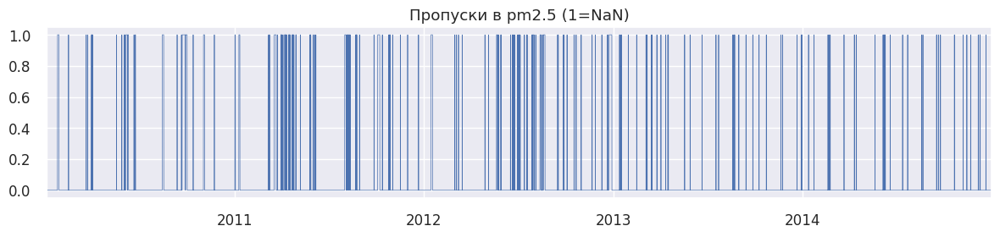

> Пропуски в PM2.5 присутствуют, но распределены неравномерно - короткими блоками. Заполнены интерполяцией.

### Распределение PM2.5

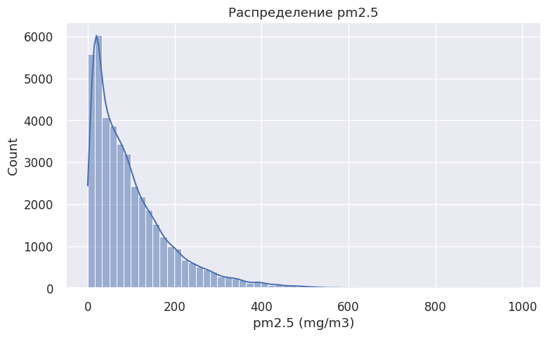

> Распределение сильно скошено вправо - большинство значений невысокие, но есть экстремальные выбросы (смог). Это типично для данных о загрязнении воздуха.

### Динамика PM2.5 по годам

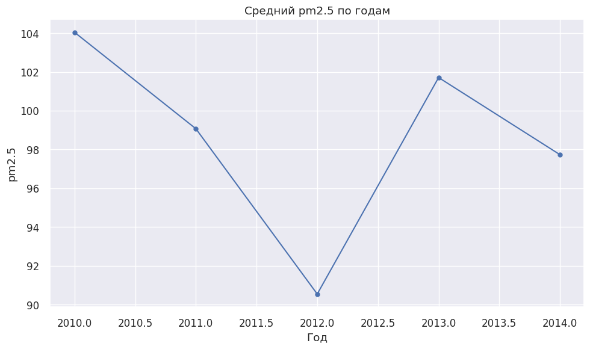

> Нет монотонного тренда роста или снижения, но видна сезонность: концентрация выше зимой и ниже летом. Это подтверждает влияние отопительного сезона.

### Суточная сезонность (по часам)

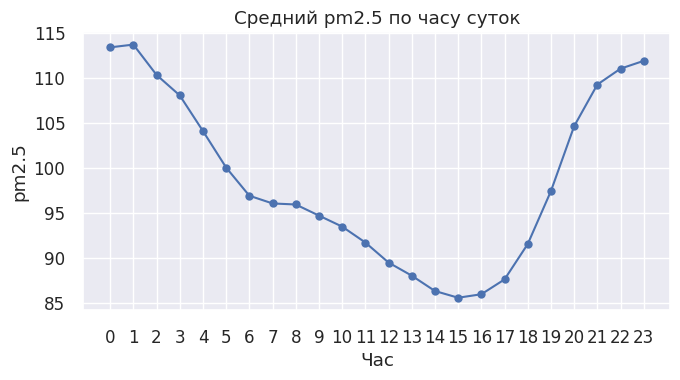

> PM2.5 имеет чёткий суточный паттерн: пики в утренние и вечерние часы (время пик трафика), минимум — в середине дня.

### Временные ряды всех признаков

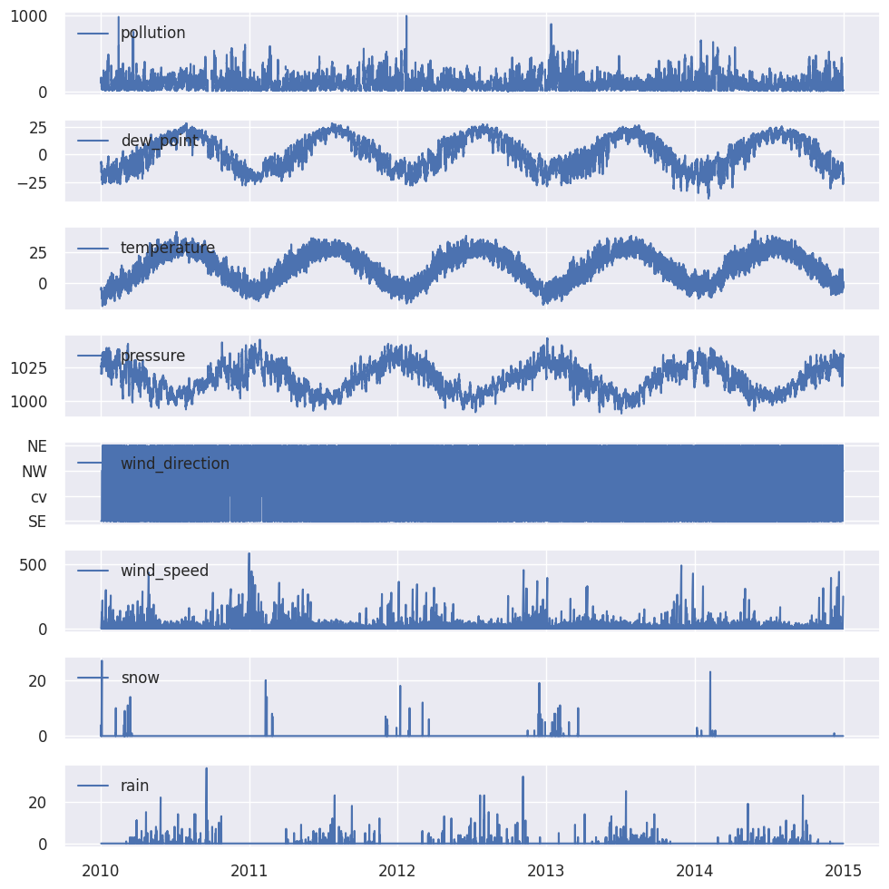

> `dew_point` и `temperature` показывают выраженную годовую сезонность. `pressure` также сезонен. `wind_speed` демонстрирует периодические всплески активности.

---

##  Корреляционный анализ

### Тепловая карта корреляций

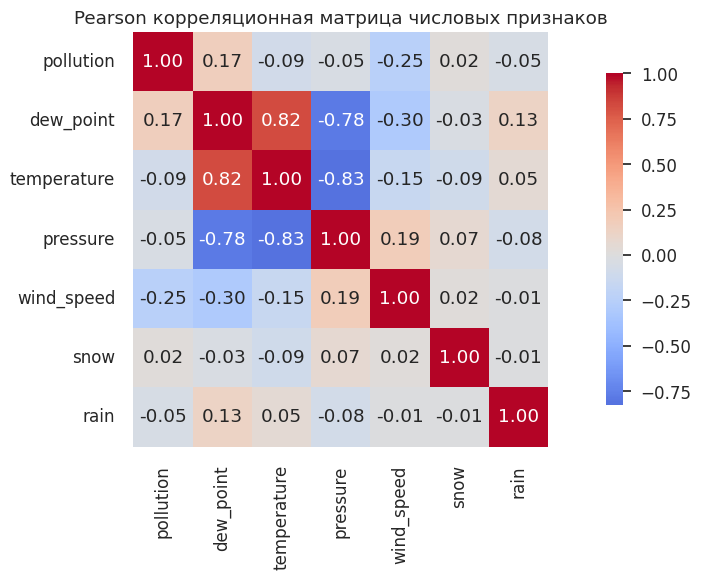

### Важность признаков (Spearman с PM2.5)

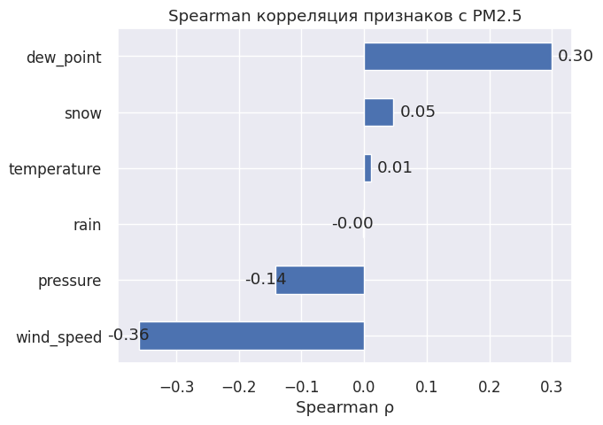

> Наиболее сильно с PM2.5 коррелируют: `dew_point` (положительно) и `wind_speed` (отрицательно - ветер рассеивает загрязнение). Давление и температура также влияют.

**Вывод из ACF:** значения PM2.5 зависят от предыдущих 24–48 часов, что подтверждает суточную закономерность. После 60–70 часов влияние прошлых значений ослабевает - это обоснование окна LSTM.

---

##  Моделирование

### Baseline LSTM (одношаговый прогноз)

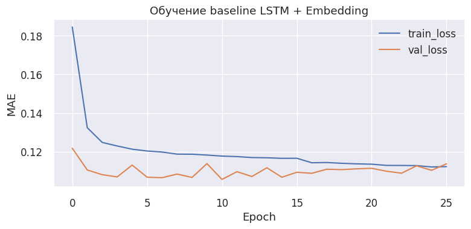

> Кривые обучения сходятся без переобучения. Train MAE и Val MAE близки - модель хорошо обобщает.

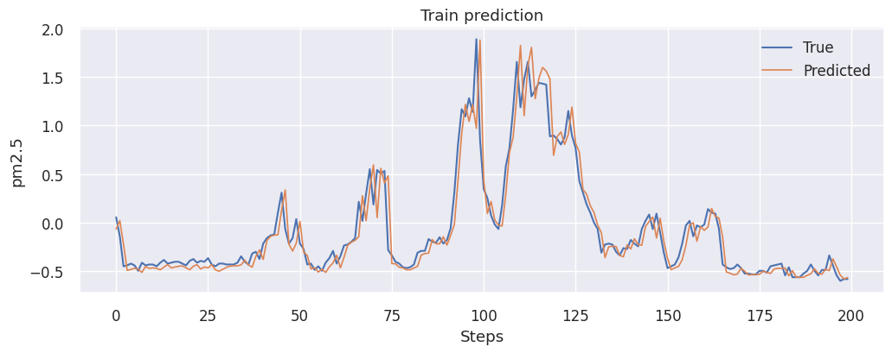

> Baseline LSTM уверенно отслеживает общую динамику PM2.5. Основные ошибки - в периоды резких скачков (экстремальные события).

| Метрика | Train | Test |
|---------|-------|------|
| MAE | 0.11 | 0.11 |

---

### Multi-step прогноз на 24 часа (1-layer LSTM)

> Прогнозирование сразу на 24 часа вперёд значительно сложнее - ошибка накапливается по горизонту.

| Метрика | Значение |
|---------|----------|
| Test MAE (avg 24h) | 56.41 μg/m³ |
| Test RMSE (avg 24h) | 88.32 μg/m³ |

---

### Seq2Seq LSTM (Encoder-Decoder с Attention)

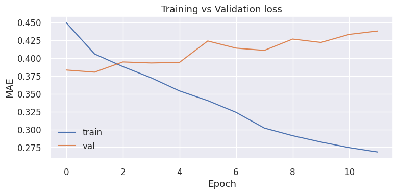

> Архитектура с Attention, Teacher Forcing и позиционным embedding часового признака.

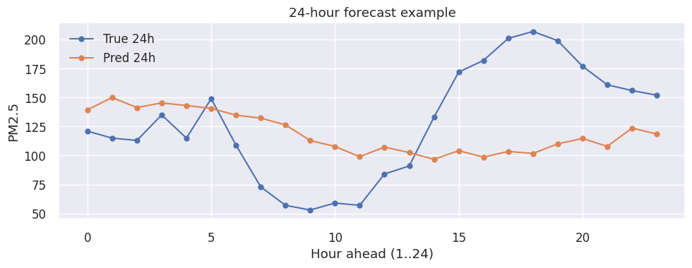

> Seq2Seq заметно точнее удерживает форму паттерна на дальнем горизонте прогноза (24 часа).

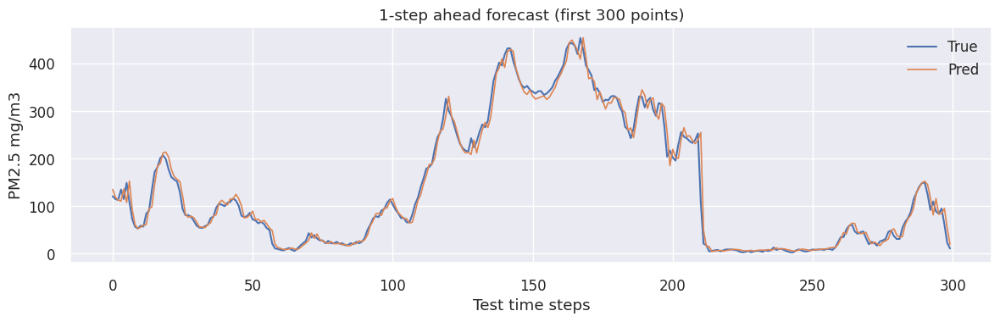

| Метрика | Значение |
|---------|----------|
| Test MAE | 12.37 μg/m³ |
| Test RMSE | 24.80 μg/m³ |

---

### Финальная модель (Seq2Seq + улучшения)

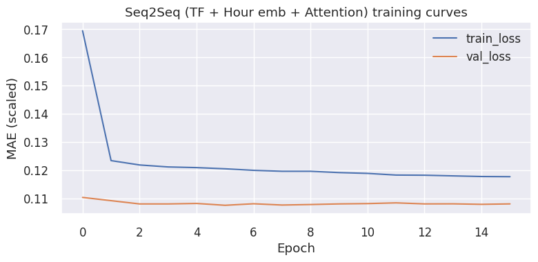

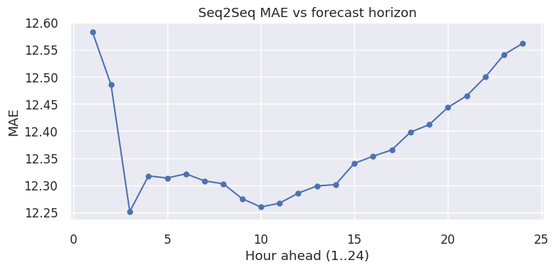

> Добавление Teacher Forcing, временного embedding и Attention позволило улучшить устойчивость прогноза и качество на дальнем горизонте, что подтверждается кривыми обучения и итоговым MAE.

---

##  Итоги

| Модель | Задача | Test MAE | Test RMSE |
|--------|--------|----------|-----------|
| Baseline LSTM | 1-step | ~12 μg/m³ | ~24 μg/m³ |
| 1-layer LSTM | 24-step | 56.41 μg/m³ | 88.32 μg/m³ |
| Seq2Seq + Attention | 24-step | **12.37 μg/m³** | **24.80 μg/m³** |

**Вывод:** Seq2Seq-архитектура с Attention и Teacher Forcing значительно превосходит простой многошаговый LSTM. Основная сложность — прогнозирование экстремальных пиков загрязнения, характерных для смога.

---

## Стек технологий

`Python` · `TensorFlow / Keras` · `pandas` · `NumPy` · `Matplotlib` · `Seaborn` · `statsmodels` · `scikit-learn`
