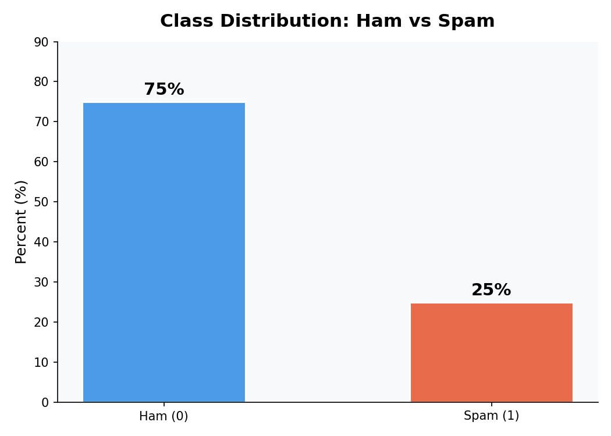
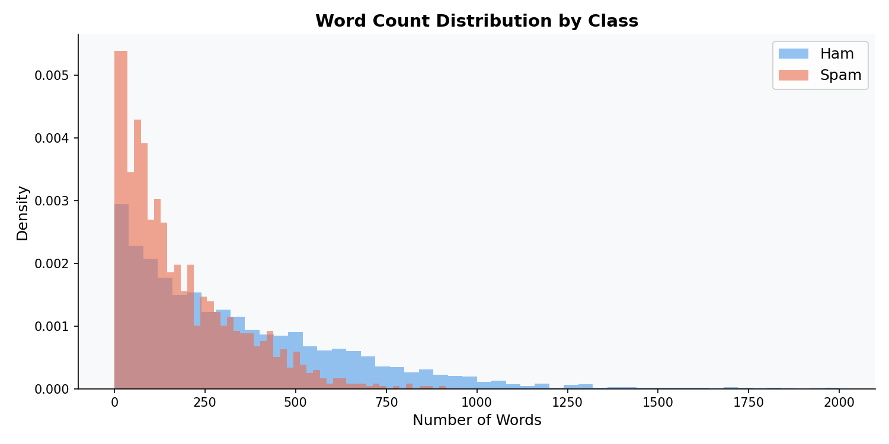
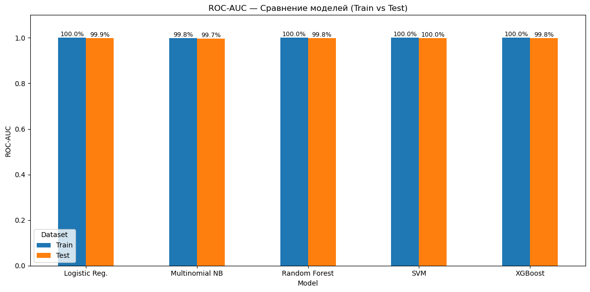
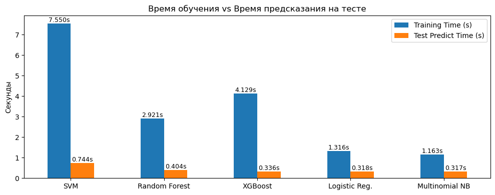

# Spam Classification - Enron Email Dataset

> **Задача:** Бинарная классификация писем - **spam (1)** или **ham (0)** - с помощью машинного обучения и TF-IDF векторизации.

---

## Датасет

**Enron Email Dataset** появился в результате расследования одного из крупнейших корпоративных скандалов в истории США - краха энергетической корпорации **Enron Corporation** в декабре 2001 года.

В ходе уголовного расследования Министерство юстиции США изъяло внутреннюю переписку сотрудников. В 2003-2004 гг. Федеральная энергетическая регуляторная комиссия (FERC) и исследователи Калифорнийского университета в Беркли опубликовали эти письма в структурированном виде.

| Параметр | Значение |
|---|---|
| Всего писем | ~500 000 |
| Пользователей | ~150 (старшие сотрудники Enron) |
| Период переписки | 1998 - начало 2002 |
| Признаки | `text`, `spam` |
| Целевая переменная | `spam`: 0 = ham, 1 = spam |

**Почему этот датасет важен:**  
Enron Dataset - один из немногих публичных корпоративных email-корпусов. Он стал золотым стандартом для задач NLP: определение спама, анализ тональности, изучение коммуникации в организациях.

---

## Анализ данных (EDA)

### Распределение классов



Датасет **несбалансирован**: ham составляет ~75%, spam - ~25%. Это учтено в моделях через параметр `class_weight='balanced'` и `scale_pos_weight`.

---

### Распределение длины писем



- Большинство писем - **короткие (0-500 слов)**
- Спам чуть чаще встречается среди очень коротких писем (0-100 слов)
- Длинные письма (>1000 слов) редки в обоих классах
- Самое длинное письмо в датасете: **8 477 слов**
- Только по длине письма сложно уверенно разделить классы

---

## Feature Engineering

Из текста извлечены дополнительные признаки:

| Признак | Описание |
|---|---|
| `email_length` | Длина письма в символах |
| `num_words` | Количество слов |
| `uppercase_ratio` | Доля заглавных букв |
| `num_exclamations` | Количество восклицательных знаков |
| `has_spammy_words` | Наличие слов-маркеров спама (free, win, money, urgent...) |

---

##  Модели

Все модели реализованы через `sklearn.pipeline.Pipeline` с **TF-IDF векторизацией** (биграммы, `ngram_range=(1,2)`):

| Модель | TF-IDF max_features | Особенности |
|---|---|---|
| SVM (LinearSVC) | 5 000 | `class_weight='balanced'` |
| Random Forest | 10 000 | `class_weight='balanced'` |
| XGBoost | 3 000 | `scale_pos_weight=3` |
| Logistic Regression | 5 000 | `class_weight='balanced'` |
| Naive Bayes | 3 000 | MultinomialNB |

**Разбивка данных:** 70% train / 30% test, `stratify=y`, `random_state=0`

---

## Результаты

### F1-score и ROC-AUC



---

### Время обучения



| Модель | Время обучения |
|---|---|
| Naive Bayes | 1.16 сек |
| Logistic Regression | 1.31 сек |
| Random Forest | 2.92 сек |
| XGBoost | 4.12 сек |
| **SVM** | **7.55 сек** |

---

##  Выводы

1. **Все 5 моделей успешно решают задачу** классификации спама и показывают высокие метрики на тестовых данных.

2. **Лучшая модель по качеству -SVM**: наивысший F1-score (0.97) и ROC-AUC (0.995) на тесте, хороший баланс Precision и Recall.

3. **Быстрейшие модели - Naive Bayes и Logistic Regression**: обучаются за 1.2 секунды при сопоставимом качестве (F1 ~0.92–0.96).

4. **Практические рекомендации:**
   - Если приоритет - **качество**: выбирать **SVM** или **XGBoost**
   - Если приоритет - **скорость и простота**: выбирать **Logistic Regression** или **Naive Bayes**

5. **Дисбаланс классов** был успешно компенсирован через `class_weight='balanced'` и `scale_pos_weight`, что подтверждается высоким Recall по классу spam.

---

##  Стек технологий


```
pandas • numpy • matplotlib • seaborn
scikit-learn • xgboost
TF-IDF • Pipeline • StratifiedSplit
```

