# 📱 Facebook Ad Click Prediction — Binary Classification

> **Задача:** Предсказать, нажмёт ли пользователь на рекламу (`Clicked`: 0 = нет, 1 = да).  
> **Тип:** Бинарная классификация. **Домен:** Digital Marketing / User Behavior.

---

## 📂 О датасете

Синтетический датасет, созданный преподавателями онлайн-курсов по машинному обучению. Имитирует поведение пользователей на онлайн-платформе — время на сайте, доход, страну и другие атрибуты. Целевая метка `Clicked` сгенерирована случайно, однако сохраняет реалистичные статистические зависимости.

| Параметр | Значение |
|---|---|
| Строк (исходный) | 499 |
| Строк (после dropna) | 430 |
| Признаков | 5 + целевая переменная |
| Тип задачи | Бинарная классификация |
| Пропущенные значения | Да (Names: 9, emails: 16, Country: 16, Time: 19, Salary: 20) |
| Баланс классов | Сбалансированный |

### Признаки

| Признак | Тип | Описание |
|---|---|---|
| `Names` | Категориальный | Имя пользователя (исключён из модели) |
| `emails` | Категориальный | Email (исключён из модели — высокая кардинальность) |
| `Country` | Категориальный | Страна пользователя |
| `Time Spent on Site` | Числовой | Время на сайте (минуты) |
| `Salary` | Числовой | Доход пользователя |
| `Clicked` | Бинарный | **Целевая переменная** |

---

## 📊 Анализ данных (EDA)

### Распределение классов

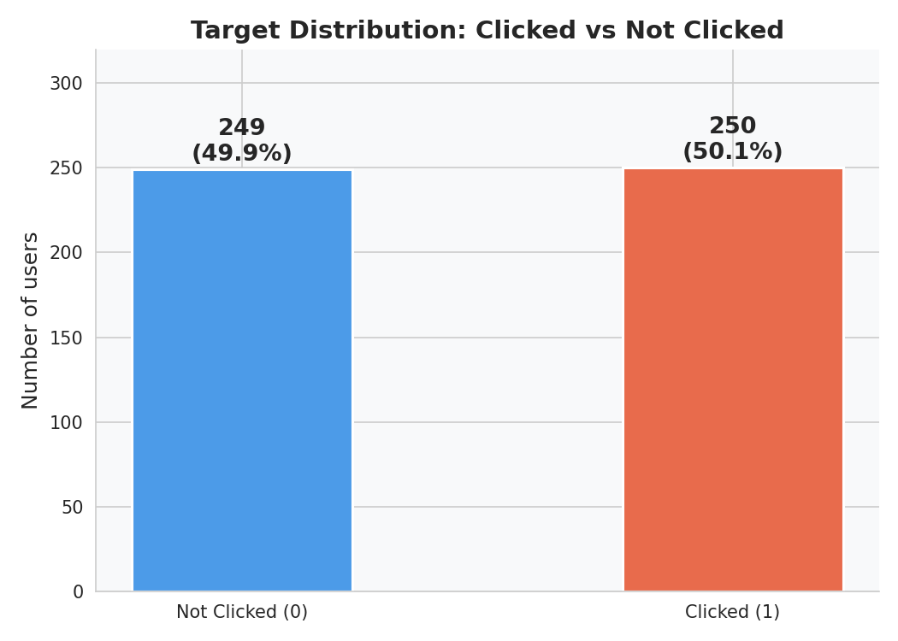

Датасет **идеально сбалансирован**: 250 кликнувших (50.1%) и 249 не кликнувших (49.9%). Балансировка не требуется.

---

### Топ-10 стран и распределение кликов

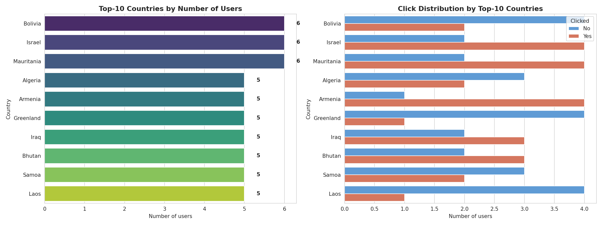

Среди топ-10 стран клики распределены равномерно — страна не является сильным предиктором. Это подтверждается низким Cramér's V.

---

### Анализ числовых признаков: Time Spent on Site

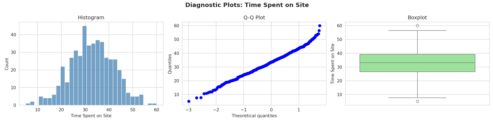

Распределение **Time Spent on Site** близко к нормальному. Выбросов нет. Большинство пользователей проводят на сайте 20–45 минут.

---

### Анализ числовых признаков: Salary

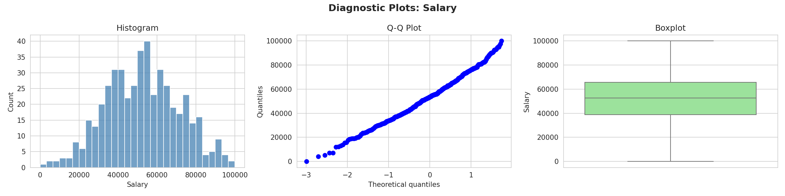

Распределение **Salary** симметрично, центрировано около $55 000. Выбросов нет — признак хорошо подходит для линейной модели.

---

### Корреляционная матрица

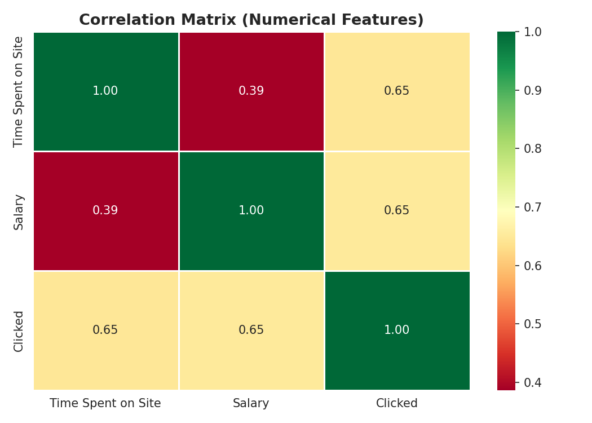

| Пара признаков | Pearson r |
|---|---|
| Time Spent on Site ↔ Clicked | **0.65** |
| Salary ↔ Clicked | **0.65** |
| Time Spent on Site ↔ Salary | 0.39 |

Оба числовых признака имеют **умеренно высокую** корреляцию с таргетом. Именно поэтому финальная модель использует только их двоих — без категориальных признаков.

---

### Cramér's V — связи категориальных признаков

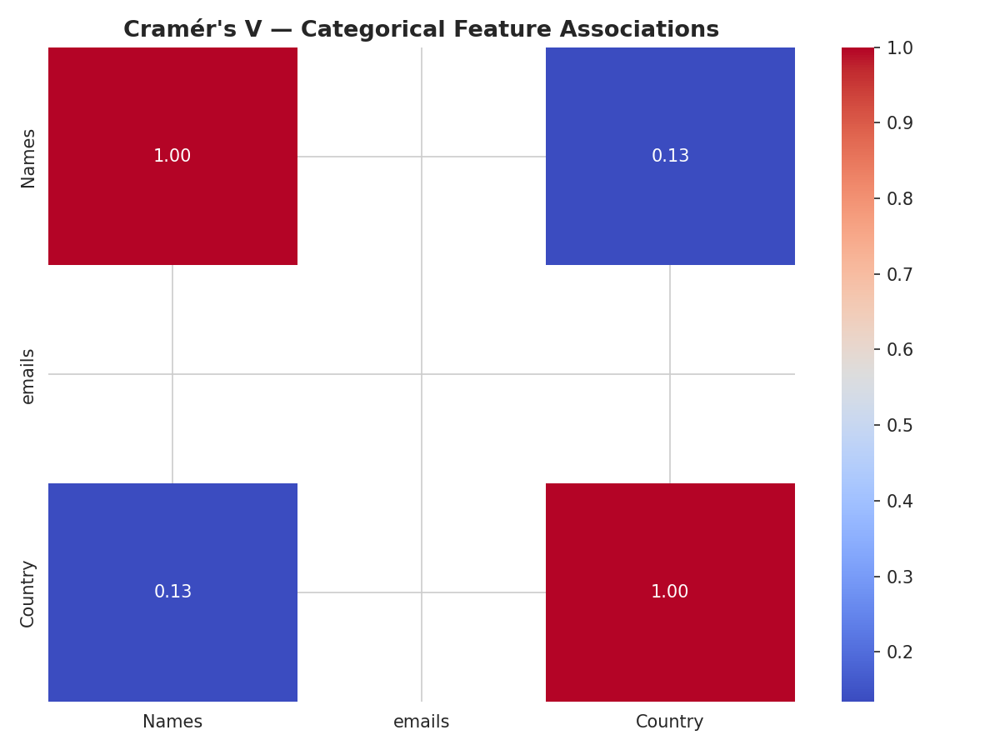

Категориальные признаки практически независимы. Незначительная связь между `Names` и `Country` (V ≈ 0.13) не несёт предиктивной ценности. `emails` исключён — слишком высокая кардинальность.

---

### Scatter: Time Spent on Site vs Salary (по клику)

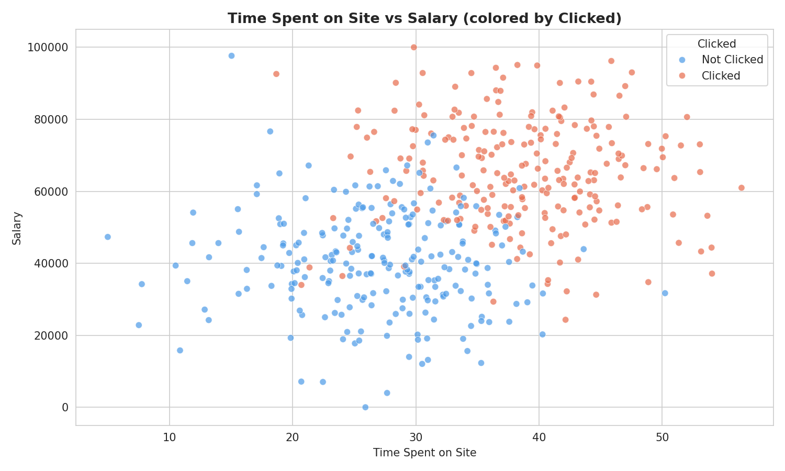

Наглядно видна **линейная граница разделения**: пользователи с высоким временем на сайте И высоким доходом склонны кликать. Задача имеет преимущественно линейную природу.

---

## ⚙️ Проверка допущений линейной модели

### Анализ остатков

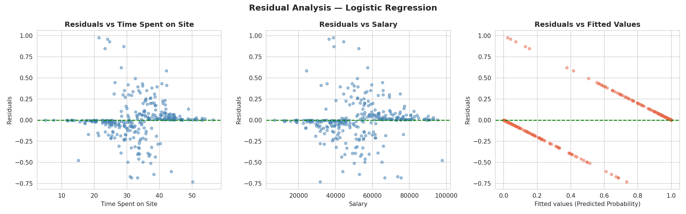

Остатки равномерно распределены вокруг нуля по всей области — **гомоскедастичность** соблюдена. Нет систематического тренда ни по `Time Spent on Site`, ни по `Salary`.

---

### Линейность log-odds (логит)

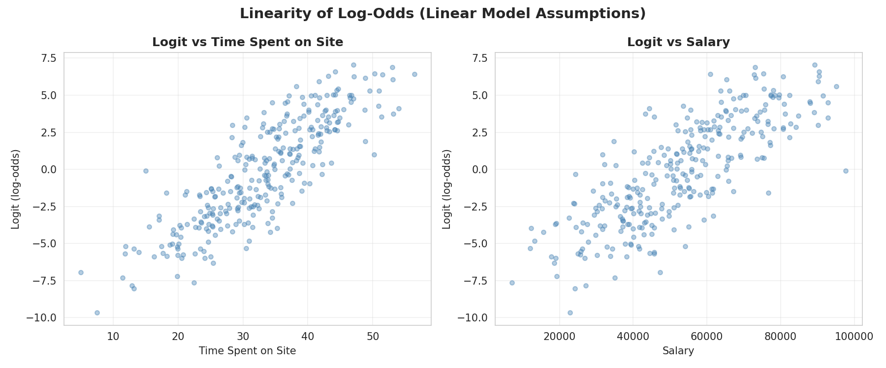

Оба признака демонстрируют **линейную зависимость** с log-odds (логитом) таргета. Точки образуют плотный кластер вдоль возрастающего тренда — подтверждение корректности логистической регрессии.

---

## 🤖 Модели

Финальный пайплайн использует **только 2 числовых признака** (`Time Spent on Site`, `Salary`). `Names`, `emails`, `Country` исключены.

```
Pipeline:
  └─ ColumnTransformer
       └─ SimpleImputer(mean) → StandardScaler  [числовые]
  └─ Модель (GridSearchCV, cv=5, scoring='accuracy')
```

| Модель | Best Params |
|---|---|
| Lasso LogReg (L1) | `C=1.0` |
| Random Forest | `max_depth=5`, `n_estimators=50` |
| XGBoost | `learning_rate=0.01`, `max_depth=3`, `n_estimators=30` |
| SVC (linear) | `C=1.0` |
| Naive Bayes | — |

---

## 📈 Результаты

### Сравнение всех метрик

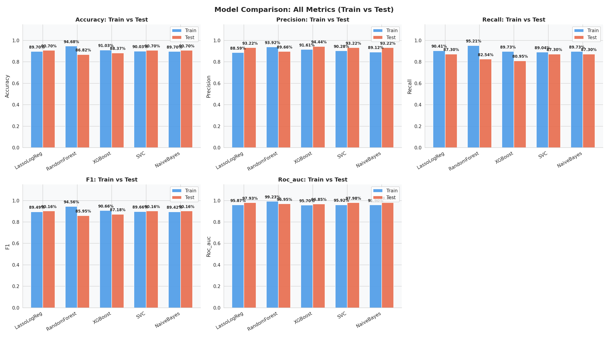

| Модель | Acc Train | Acc Test | F1 Train | F1 Test | ROC-AUC Test |
|---|---|---|---|---|---|
| **LassoLogReg** | 89.70% | **90.70%** | 89.49% | **90.16%** | **97.93%** |
| **SVC** | 90.03% | **90.70%** | 89.66% | **90.16%** | **97.98%** |
| **Naive Bayes** | 89.70% | **90.70%** | 89.42% | **90.16%** | **98.00%** |
| Random Forest | 94.68% | 86.82% | 94.56% | 85.95% | 96.95% |
| XGBoost | 91.03% | 88.37% | 90.66% | 87.18% | 96.85% |

---

### Confusion Matrices — все модели

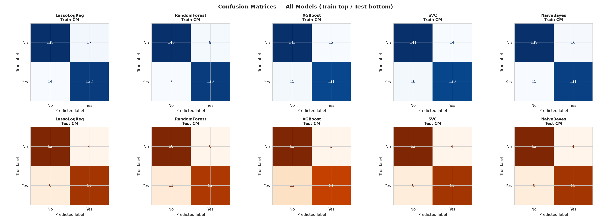

---

## 🏆 Выводы

1. **Lasso Logistic Regression** — лучшая модель по совокупности метрик: Accuracy = **90.7%**, F1 = **90.2%**, ROC-AUC = **97.9%** на тесте. Минимальный разрыв train/test — нет переобучения.

2. **SVC и Naive Bayes** показывают идентичный результат с LassoLogReg — три модели приходят к одной точности на линейно разделимых данных.

3. **Random Forest и XGBoost переобучаются**: разрыв train/test по Accuracy — 7–8 п.п. Требуют дополнительной регуляризации.

4. **Данные имеют линейную природу**: анализ остатков и логит-графики подтверждают, что задача хорошо решается линейными методами.

5. **Достаточно 2 признаков**: `Time Spent on Site` и `Salary` (r ≈ 0.65 с таргетом каждый) полностью описывают сигнал в данных. Включение `Country` через OHE не улучшает результат.

6. **Пропущенные значения** (~5–8% по числовым признакам) обработаны через `dropna` — датасет синтетический, пропуски не несут информации.

---

## 🛠️ Стек технологий


```
pandas • numpy • scipy • matplotlib • seaborn
scikit-learn • xgboost
Pipeline • ColumnTransformer • GridSearchCV • StratifiedKFold
LogisticRegression (L1) • RandomForest • XGBoost • SVC • GaussianNB
StandardScaler • OneHotEncoder • SelectKBest • mutual_info_classif
```

---

## 📁 Структура проекта

```
├── Facebook_without_catcols-checkpoint.ipynb   # Модель без категориальных признаков
├── Facebook_ohe_cat_cols.ipynb                 # Модель с OHE для Country
├── Facebook_Ads_2_TP.csv                       # Датасет
├── 01_class_distribution.png
├── 02_countries.png
├── 03_diagnostic_time.png
├── 04_diagnostic_salary.png
├── 05_corr_heatmap.png
├── 06_cramers_v.png
├── 07_scatter_clicked.png
├── 08_residuals.png
├── 09_logit_linearity.png
├── 10_all_metrics.png
├── 11_confusion_matrices.png
└── README.md
```
