# ❤️ Heart Disease Prediction

> **Задача:** Бинарная классификация - предсказать наличие болезни сердца по медицинским данным пациента (`target`: 0 = здоров, 1 = болен).

---

## О датасете

Датасет создан на основе клинических исследований в четырёх медицинских центрах:

- **Cleveland Clinic Foundation** (Кливленд, Огайо) - основной, 303 наблюдения
- **Hungarian Institute of Cardiology** (Будапешт)
- **VA Medical Center** (Long Beach, Калифорния)
- **University Hospital** (Цюрих, Швейцария)

Цель исследования - разработка алгоритмов неинвазивной диагностики ишемической болезни сердца по показателям артериального давления, холестерина, ЭКГ и других признаков. Опубликован в **UCI Machine Learning Repository** - одном из старейших источников данных для машинного обучения. Исходно содержит 76 атрибутов, для анализа используют 14 наиболее информативных.

| Параметр | Значение |
|---|---|
| Наблюдений | 303 |
| Признаков | 13 + целевая переменная |
| Тип задачи | Бинарная классификация |
| Целевая переменная | `target`: 0 = нет болезни, 1 = болезнь |
| Пропущенные значения | Нет |

### Признаки

| Признак | Тип | Описание |
|---|---|---|
| `age` | Числовой | Возраст |
| `sex` | Категориальный | Пол (0 = женщина, 1 = мужчина) |
| `cp` | Категориальный | Тип боли в груди (0–3) |
| `trestbps` | Числовой | Артериальное давление в покое |
| `chol` | Числовой | Уровень холестерина |
| `fbs` | Категориальный | Сахар натощак > 120 мг/дл |
| `restecg` | Категориальный | ЭКГ в покое |
| `thalach` | Числовой | Максимальная ЧСС при нагрузке |
| `exang` | Категориальный | Стенокардия при нагрузке |
| `oldpeak` | Числовой | Депрессия сегмента ST |
| `slope` | Категориальный | Наклон сегмента ST |
| `ca` | Категориальный | Число крупных сосудов (0–4) |
| `thal` | Категориальный | Результат сцинтиграфии |

---

##  Анализ данных (EDA)

### Распределение классов

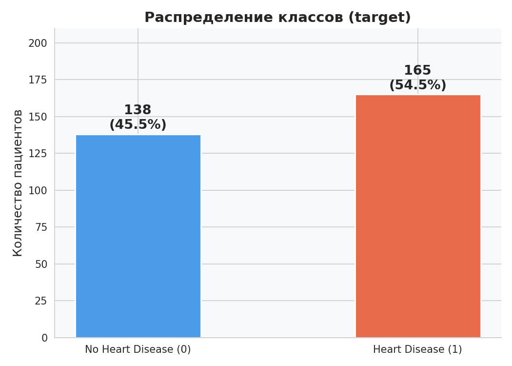

Датасет практически **сбалансирован**: 165 пациентов с болезнью сердца (54.5%) и 138 без болезни (45.5%). Балансировка классов не требуется.

---

### Числовые признаки по классам

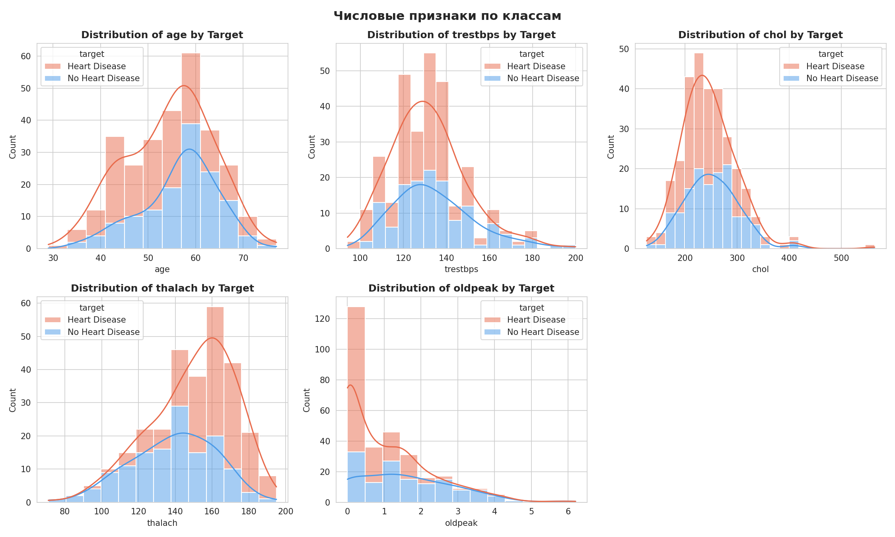

Ключевые наблюдения:
- **thalach** (макс. ЧСС): у больных пациентов значительно выше (140–170) - главный разделяющий признак
- **oldpeak** (депрессия ST): у здоровых чаще значения > 2, у больных - ниже 1
- **age**: болезнь чаще у пациентов 40–60 лет; у более пожилых (>65) доля без болезни выше
- **chol** и **trestbps**: слабо разделяют классы, распределения сильно перекрываются

---

### Категориальные признаки по классам

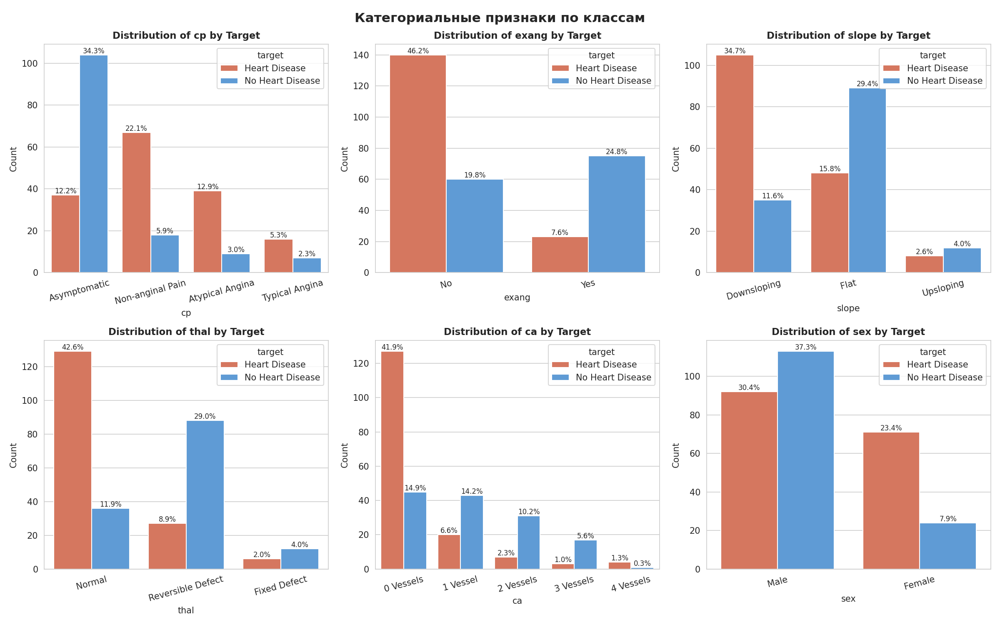

- **cp** (тип боли): нетипичная стенокардия (cp=1, cp=2) ассоциирована с болезнью
- **exang** (стенокардия при нагрузке): отсутствие боли при нагрузке - парадоксально связано с болезнью
- **slope**: восходящий ST (slope=2) чаще у больных
- **thal**: типы 2 и 3 ассоциированы с болезнью
- **ca**: отсутствие поражённых сосудов (ca=0) чаще у больных
- **sex**: мужчины преобладают в выборке, у женщин доля больных выше

---

### Корреляционная матрица

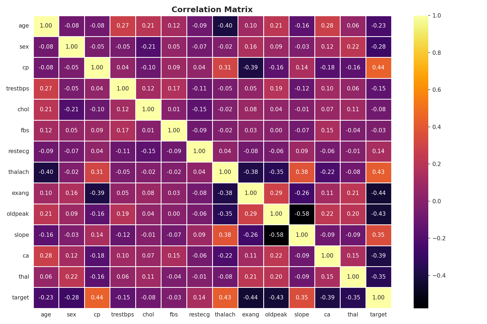

**Наибольшая положительная корреляция с target:** `cp` (+0.43), `thalach` (+0.42)

**Наибольшая отрицательная корреляция с target:** `exang` (−0.44), `oldpeak` (−0.43), `ca` (−0.38), `thal` (−0.34)

**Сильная взаимосвязь между признаками:** `oldpeak` и `slope` (−0.58)

---

### Анализ выбросов (IQR метод)

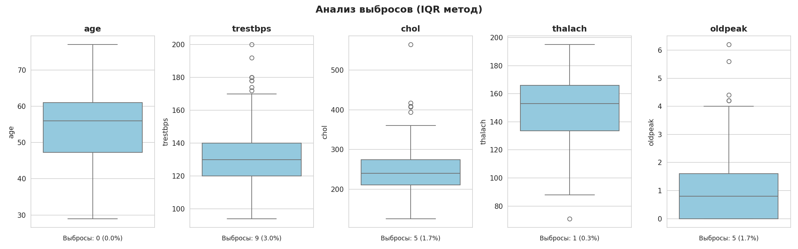

Наиболее «шумные» признаки: `chol`, `trestbps`, `thalach`, `oldpeak`. Для обработки применена комбинация **Log-трансформации** и **RobustScaler**.

---

### До и после обработки выбросов

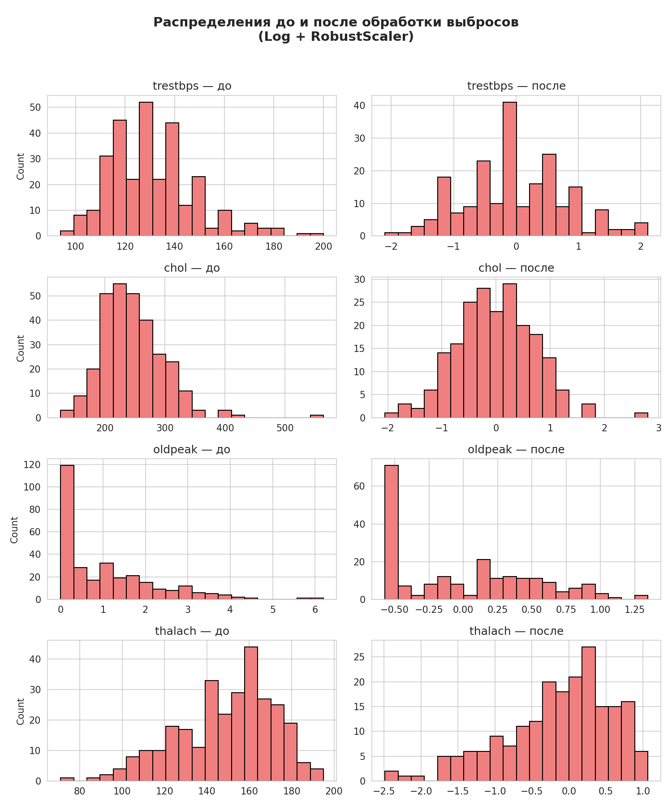

Применены: `log1p`-трансформация для правосторонне-скошенных признаков + `RobustScaler` (устойчив к выбросам). После обработки распределения стали более симметричными.

---

##  Feature Engineering

| Шаг | Описание |
|---|---|
| Импутация числовых | `MeanMedianImputer` (median) |
| Импутация категориальных | `CategoricalImputer` (most_frequent) |
| Winsorizer | Ограничение выбросов `trestbps`, `chol` (квантили 2%–98%) |
| OHE | `category_encoders.OneHotEncoder` для категориальных признаков |
| Масштабирование | `RobustScaler` для числовых признаков (LogReg) |
| Отбор признаков | `SelectKBest` (ANOVA и Mutual Information, k=10) |

---

##  Модели

Все финальные модели обёрнуты в `Pipeline` с feature_engine препроцессингом. Гиперпараметры подобраны через `GridSearchCV (cv=5, scoring='recall')`.

| Модель | Препроцессинг |
|---|---|
| Logistic Regression | Winsorizer + OHE + RobustScaler |
| Random Forest | MeanMedianImputer + CategoricalImputer |
| Decision Tree | MeanMedianImputer + CategoricalImputer |
| LightGBM | MeanMedianImputer + CategoricalImputer |

**Разбивка:** 70% train / 30% test, `stratify=y`, `random_state=0`

---

##  Результаты

### ROC-кривые базовых моделей

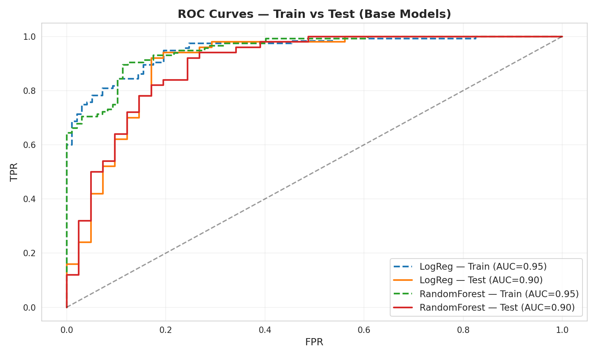

---

### Сравнение финальных моделей

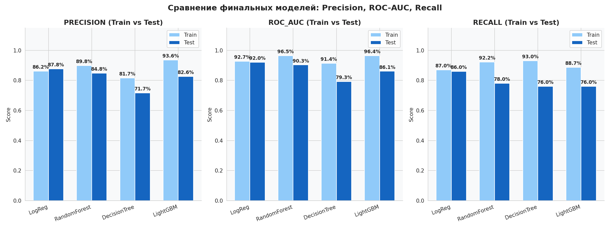

| Модель | Precision Test | ROC-AUC Test | Recall Test |
|---|---|---|---|
| **Logistic Regression** | **87.8%** | **92.0%** | **86.0%** |
| Random Forest | 84.8% | 90.3% | 78.0% |
| LightGBM | 82.6% | 86.1% | 76.0% |
| Decision Tree | 71.7% | 79.3% | 76.0% |

---

### Confusion Matrices - Test Set

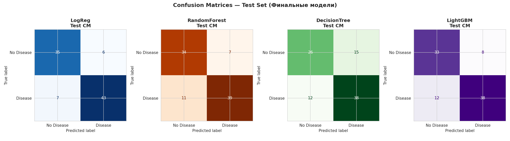

---

### Feature Importance - Logistic Regression

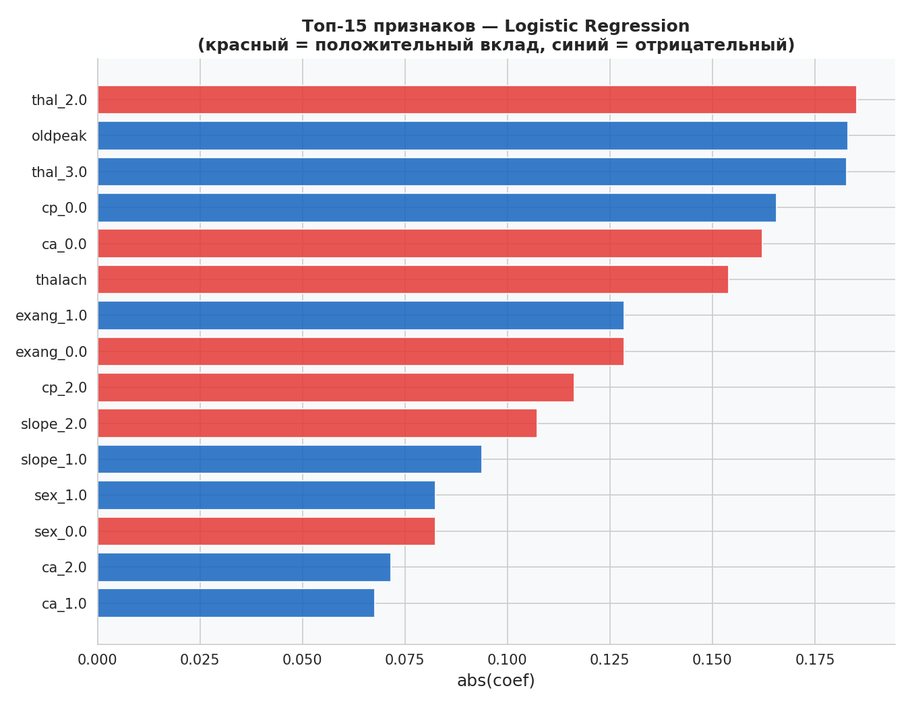

---

### Feature Importance - Random Forest

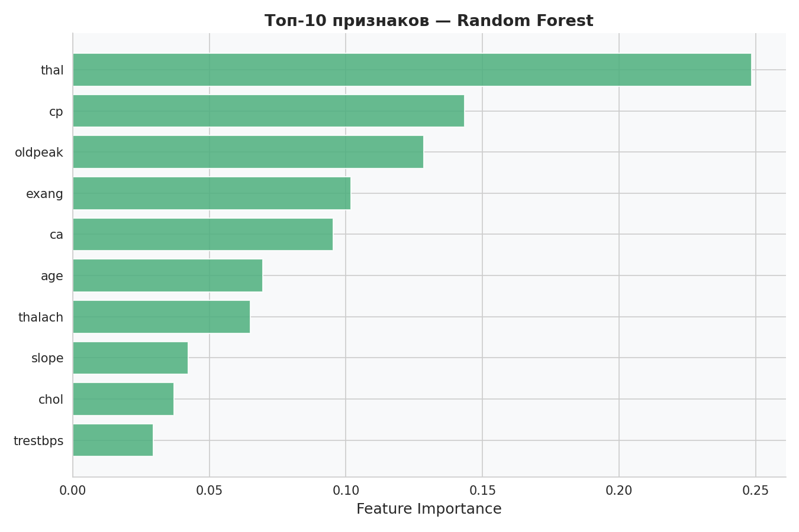

---

##  Выводы

1. **Лучшая модель - Logistic Regression**: ROC-AUC = **0.92**, Precision = **87.8%**, Recall = **86.0%** на тесте. Минимальный разрыв между train и test - нет переобучения.

2. **Random Forest и LightGBM переобучаются**: высокие train-метрики (AUC ≥ 0.96) против заметно сниженных test-метрик.

3. **Наиболее значимые признаки** (по обеим моделям): `thalach`, `cp`, `ca`, `thal`, `oldpeak`, `exang` - клинически логичный результат.

4. **Логистическая регрессия предпочтительна для медицины**: она интерпретируема, коэффициенты указывают направление и силу влияния каждого признака, что важно для врачей.

5. **Ключевые факторы риска болезни сердца** в данной выборке:
   - Высокая максимальная ЧСС (`thalach`)
   - Нетипичная боль в груди (`cp = 1, 2`)
   - Отсутствие видимых поражений сосудов (`ca = 0`)
   - Патологические результаты сцинтиграфии (`thal = 2, 3`)

6. **Ограничение датасета**: небольшой размер (303 наблюдения) - для продакшн-решений необходимо больше данных.

---

##  Стек технологий


```
pandas • numpy • matplotlib • seaborn
scikit-learn • lightgbm • feature-engine • category-encoders
Pipeline • GridSearchCV • StratifiedKFold
SelectKBest (ANOVA, Mutual Information) • RobustScaler • Winsorizer
```

---

