# House Price Prediction - AdaBoost Regressor

> **Задача:** Регрессия - предсказать стоимость жилья (`SalePrice`) по 80 характеристикам дома. Модель: **AdaBoost** с лог-трансформацией таргета.

---

##  О датасете

Датасет **Ames Housing** - расширенная альтернатива классическому Boston Housing. Содержит подробные характеристики жилых домов в г. Эймс, штат Айова, США.

| Параметр | Значение |
|---|---|
| Наблюдений | 1 460 |
| Признаков | 80 + целевая переменная |
| Тип задачи | Регрессия |
| Целевая переменная | `SalePrice` - цена продажи дома |
| Пропущенных значений | 7 829 |
| Категориальных признаков | 43 |
| Числовых признаков | 38 |

### Типы признаков

| Группа | Примеры |
|---|---|
| Качество | `OverallQual`, `ExterQual`, `KitchenQual`, `BsmtQual` |
| Площади | `GrLivArea`, `TotalBsmtSF`, `1stFlrSF`, `LotArea` |
| Год | `YearBuilt`, `YearRemodAdd`, `GarageYrBlt` |
| Гараж | `GarageType`, `GarageFinish`, `GarageCars`, `GarageArea` |
| Подвал | `BsmtQual`, `BsmtFinSF1`, `BsmtUnfSF`, `TotalBsmtSF` |
| Локация | `Neighborhood`, `MSZoning`, `Condition1` |

---

##  Анализ данных (EDA)

### Целевая переменная - SalePrice

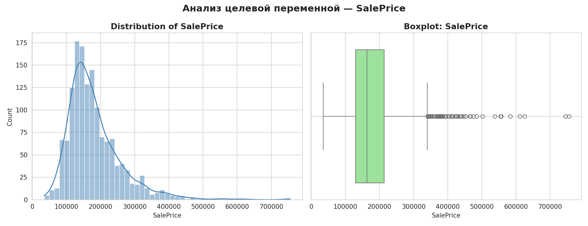

Распределение `SalePrice` имеет **правостороннюю асимметрию** (mean = $180 921, max = $755 000). Для улучшения качества модели применена **log1p-трансформация таргета** через `TransformedTargetRegressor`.

---

### Пропущенные значения в категориальных признаках

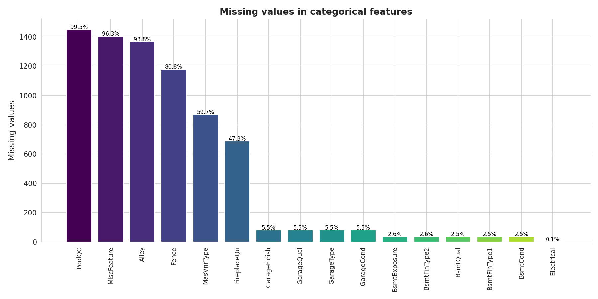

Большинство пропусков в категориальных признаках - **не случайные**: `PoolQC`, `MiscFeature`, `Alley`, `Fence`, `FireplaceQu` означают отсутствие объекта. Заполнены значением `'no_option'`.

---

### Пропущенные значения в числовых признаках

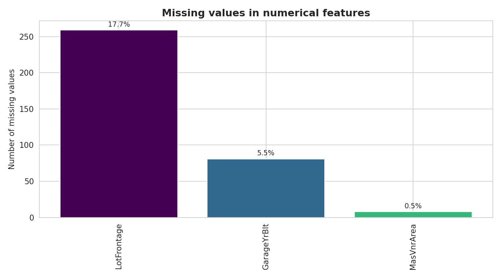

- `LotFrontage` (~18%) - заполнен медианой по `Neighborhood` + флаг пропуска `LotFrontage_missing`
- `GarageYrBlt` - заполнен значением `YearBuilt`
- `MasVnrArea` - заполнен нулём

---

### Количество уникальных категорий (Cardinality)

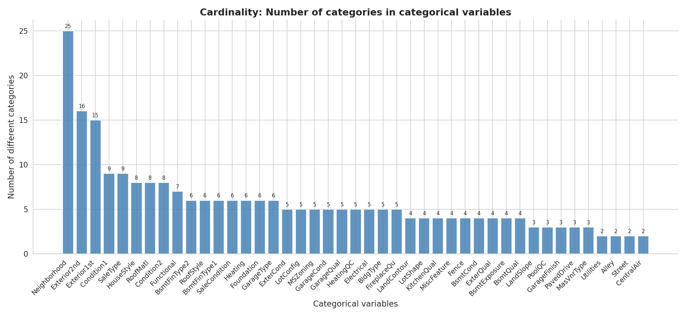

Признаки с высокой кардинальностью (`Neighborhood`, `Exterior1st`, `Exterior2nd`) закодированы через **Target Encoding** - позволяет избежать взрыва размерности при OHE.

---

### Средняя цена по ключевым категориальным признакам

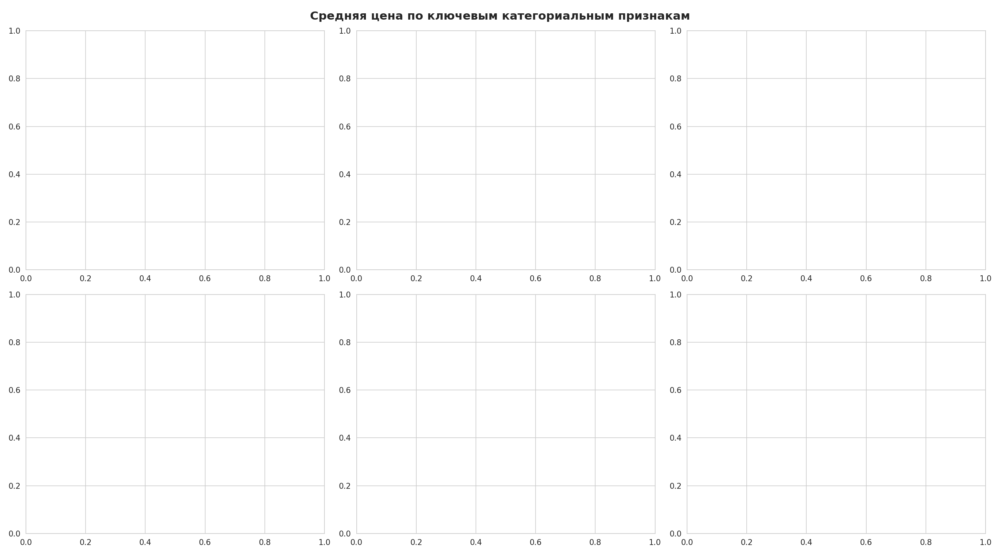

- **Neighborhood**: разброс средней цены от ~$100K до ~$335K - один из самых информативных признаков
- **ExterQual / KitchenQual**: чёткая монотонная зависимость - качество `Ex` вдвое дороже `Fa`
- **BsmtQual**: качество подвала сильно влияет на цену
- **GarageFinish**: отделанный гараж (`Fin`) значимо дороже неотделанного

---

### Процент выбросов в числовых признаках (IQR метод)

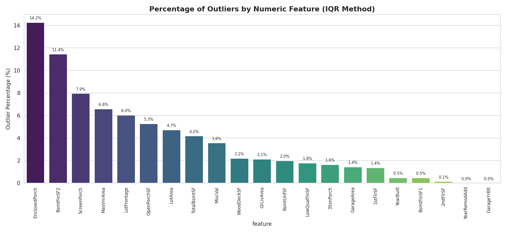

Наибольший процент выбросов у `MiscVal`, `PoolArea`, `ScreenPorch`, `LowQualFinSF`. Обработка: **Winsorizer** с методом `gaussian` (fold=1.5) в пайплайне.

---

### Корреляционная матрица числовых признаков (Pearson)

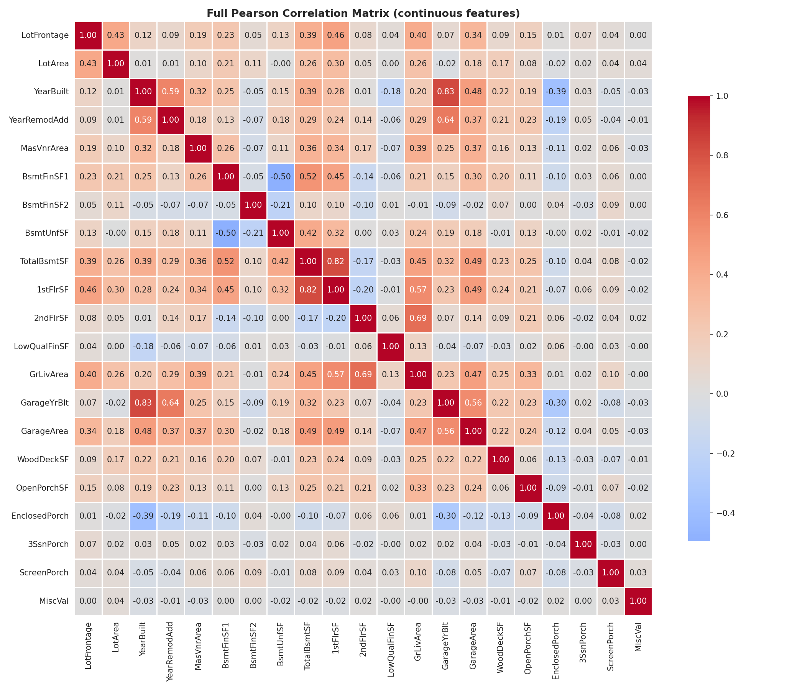

---

### Сильно коррелированные пары (|Pearson r| ≥ 0.5)

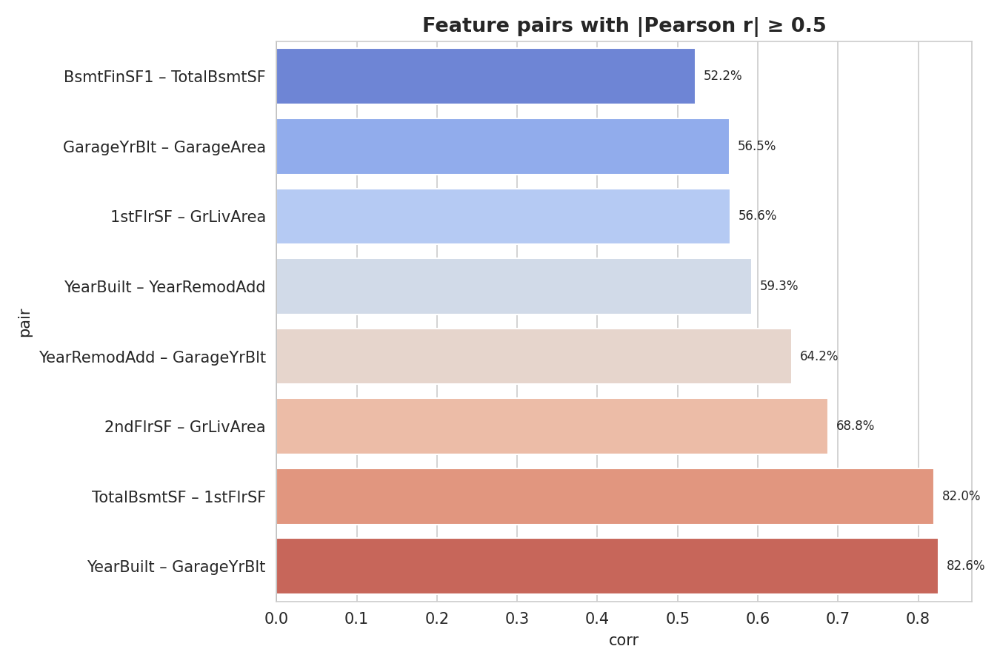

Сильные корреляции между признаками площади (`GrLivArea`, `1stFlrSF`, `TotalBsmtSF`) и гаража (`GarageArea`, `GarageCars`). Мультиколлинеарность устранена через `SmartCorrelatedSelection(threshold=0.95)`.

---

### Сильные связи между категориальными признаками (Cramér's V > 0.5)

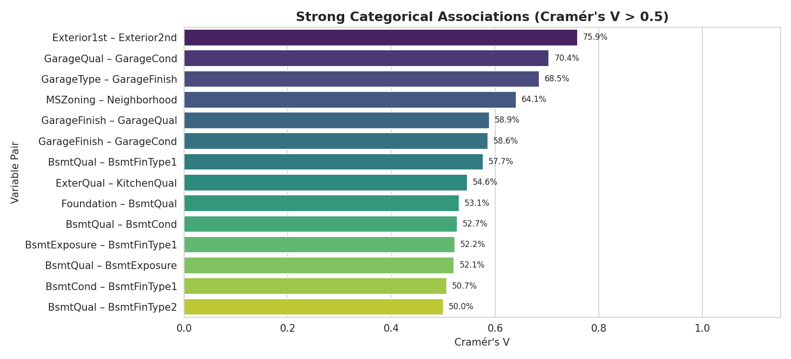

14 сильных пар: `Exterior1st – Exterior2nd`, `GarageQual – GarageCond`, `BsmtQual – BsmtCond`, `ExterQual – KitchenQual` и другие. Объясняются конструктивными особенностями домов.

---

##  Preprocessing Pipeline

| Шаг | Метод | Назначение |
|---|---|---|
| Импутация NA-категорий | `'no_option'` | PoolQC, Fence, Alley, Garage и др. |
| Импутация LotFrontage | Медиана по Neighborhood | + флаг пропуска |
| Импутация числовых | 0 / YearBuilt | MasVnrArea, GarageYrBlt |
| Удаление квазиконстант | `DropConstantFeatures(tol=0.98)` | |
| Удаление дублей | `DropDuplicateFeatures` | |
| Удаление мультиколлинеарности | `SmartCorrelatedSelection(r=0.95)` | |
| Порядковое кодирование | `OrdinalEncoder` | ExterQual, KitchenQual и др. |
| Кодирование категорий | `TargetEncoder(smoothing=0.3)` | Neighborhood, MSZoning и др. |
| Ограничение выбросов | `Winsorizer(gaussian, fold=1.5)` | Числовые признаки |
| Трансформация таргета | `log1p` / `expm1` | Устранение правой асимметрии |

После отбора признаков: **1168 × 73** (train), **292 × 73** (test)

---

##  Модель - AdaBoost Regressor

```
TransformedTargetRegressor(func=log1p, inverse_func=expm1)
  └─ Pipeline:
       ├─ prep: ColumnTransformer
       │    ├─ num: Winsorizer(gaussian, fold=1.5)
       │    ├─ ord: OrdinalEncoder
       │    └─ cat: TargetEncoder(smoothing=0.3)
       └─ model: AdaBoostRegressor(random_state=42)
```

**GridSearchCV (cv=5, scoring='neg_MAE')** по сетке:
`n_estimators` ∈ [50, 100] × `learning_rate` ∈ [0.01, 0.1, 1.0]

**Лучшие параметры:** `n_estimators=100`, `learning_rate=1.0`

---

##  Результаты

### MAE, RMSE и R² - Train vs Test

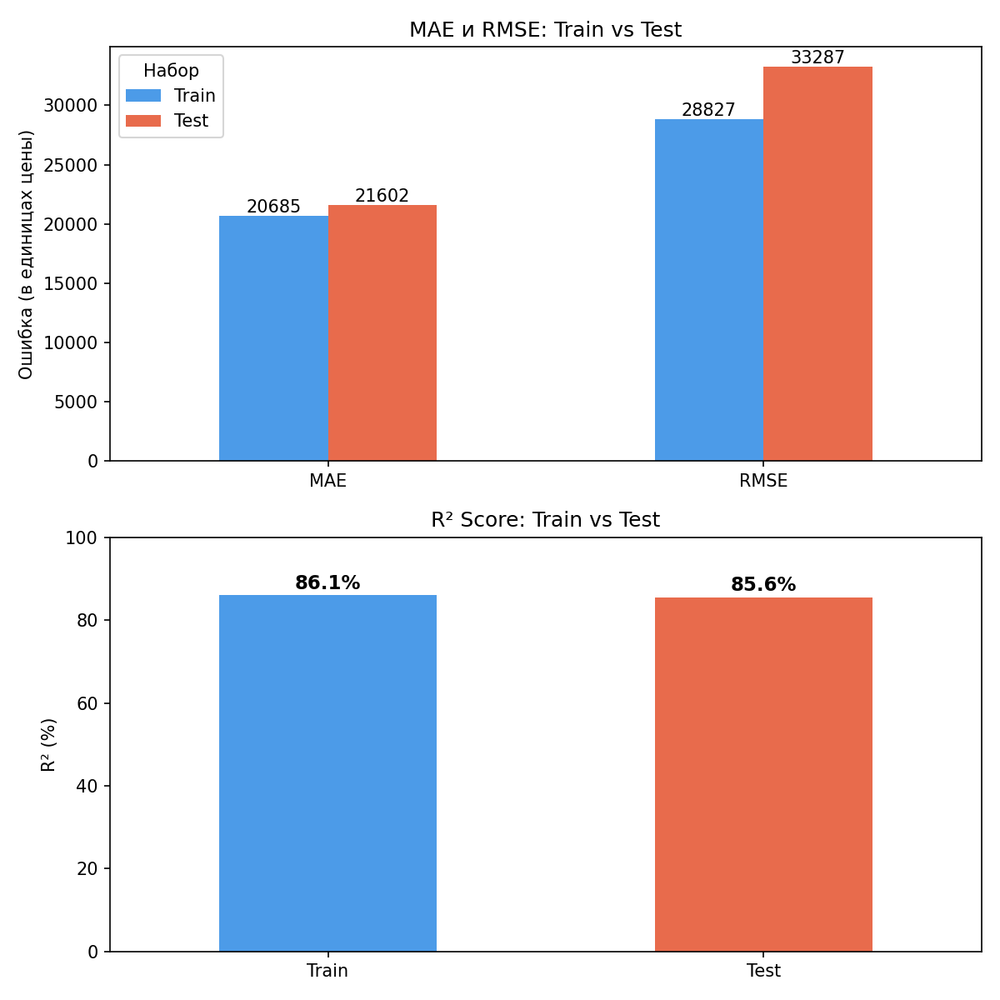

| Метрика | Train | Test |
|---|---|---|
| MAE | $20 685 | $21 602 |
| RMSE | $28 827 | $33 287 |
| **R²** | **86.1%** | **85.6%** |

---

### Анализ остатков

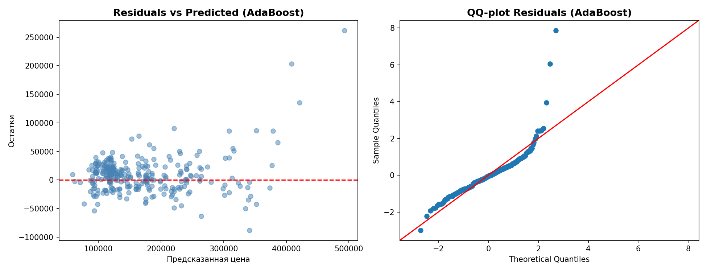

Scatter plot остатков показывает, что модель **стабильна и не переобучена** - основная масса ошибок сосредоточена около нуля. QQ-plot выявляет **тяжёлый правый хвост**: очень дорогие дома ($500K+) предсказываются с большей ошибкой - это известное ограничение AdaBoost на экстремальных значениях.

---

### Feature Importance - Top 20 признаков

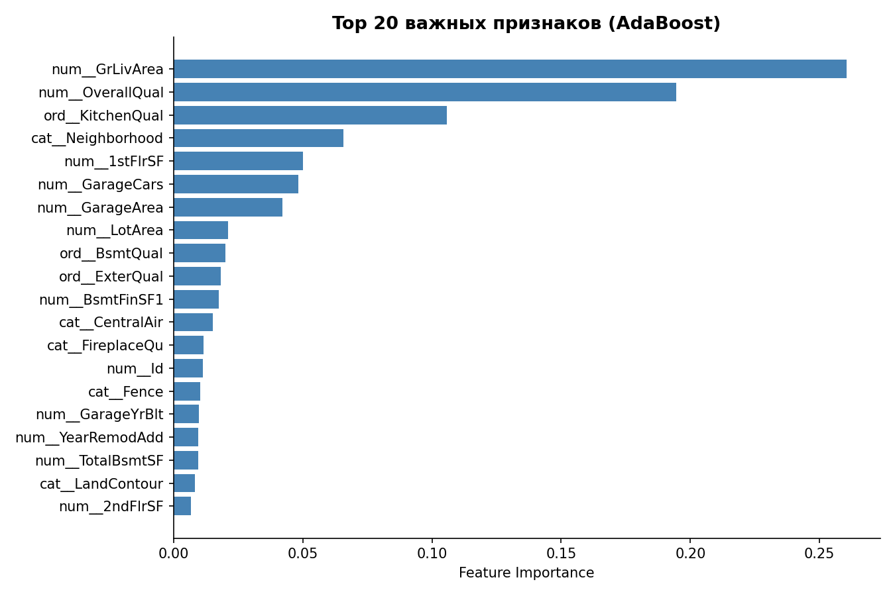

---

##  Выводы

1. **Модель AdaBoost хорошо обобщается**: R² Train = 86.1%, R² Test = 85.6% - разница минимальная, переобучения нет.

2. **MAE на тесте - $21 602**: в среднем ошибка ~12% от средней цены ($180K). Для AdaBoost без ансамблирования - хороший результат.

3. **RMSE > MAE** - модель делает редкие, но крупные ошибки на самых дорогих домах (правый хвост), что подтверждается QQ-plot.

4. **Log-трансформация таргета** (`log1p`) существенно улучшила качество - без неё AdaBoost страдает от асимметрии цен.

5. **Target Encoding** с `smoothing=0.3` эффективно обработал высококардинальные признаки (`Neighborhood`, `Exterior`) без взрыва размерности.

6. **Ключевые признаки по важности**: качество (`OverallQual`, `ExterQual`, `KitchenQual`), площади (`GrLivArea`, `TotalBsmtSF`), год постройки (`YearBuilt`), район (`Neighborhood`).

---

##  Стек технологий


```
pandas • numpy • scipy • matplotlib • seaborn • statsmodels
scikit-learn • feature-engine • category-encoders
Pipeline • ColumnTransformer • TransformedTargetRegressor
GridSearchCV • AdaBoostRegressor • TargetEncoder • Winsorizer
SmartCorrelatedSelection • OrdinalEncoder
```

---

