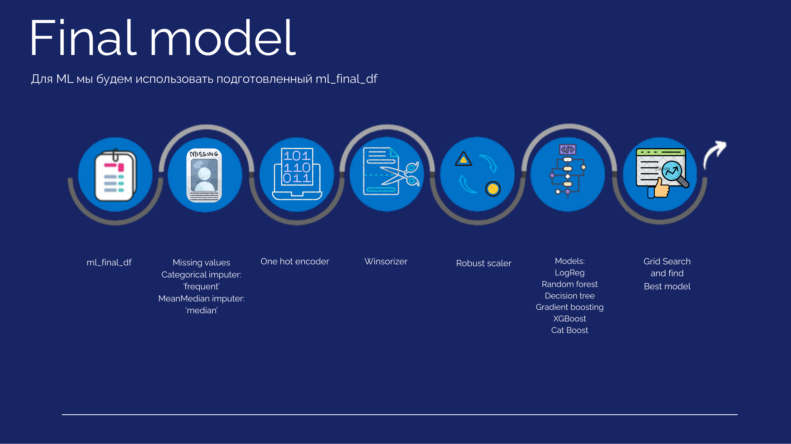
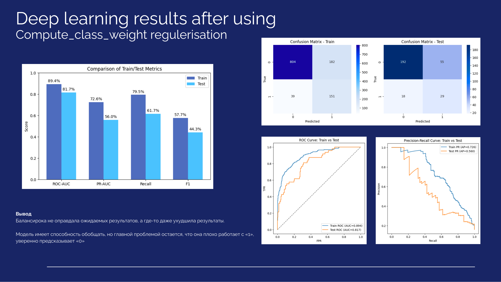
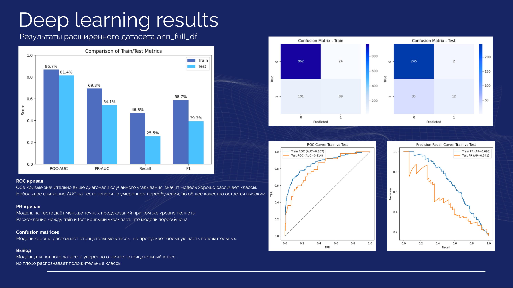
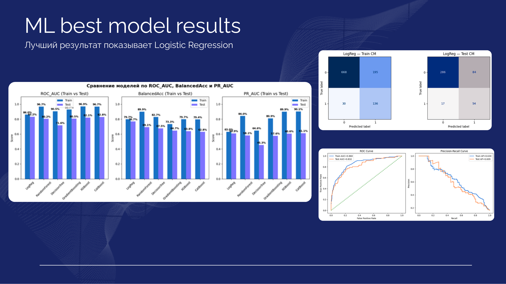
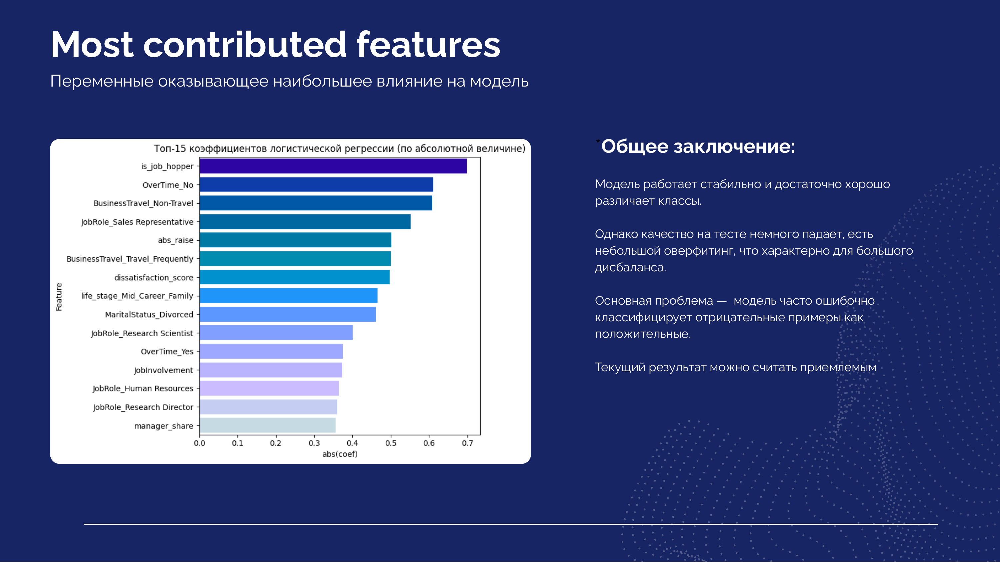
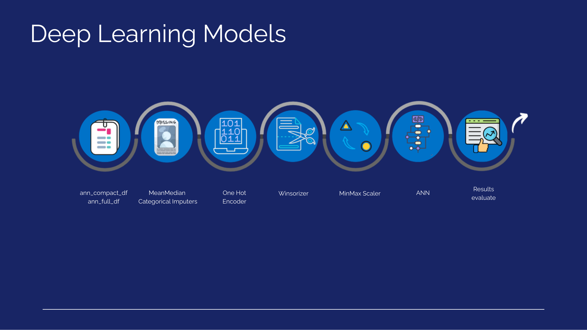
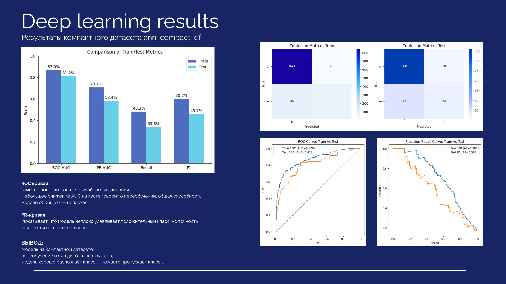

#  IBM HR Analytics — Прогнозирование текучести сотрудников

> Командный проект школы **VeraVla**. Моя роль в проекте - анализ данных и обучение моделей.

---

## О проекте

Полный цикл разработки ML-модели на датасете **IBM HR Analytics Employee Attrition & Performance** — одном из классических датасетов в области People Analytics.

**Цель:** предсказать, уволится ли сотрудник - бинарная классификация по признаку `Attrition`.

Датасет содержит **35 признаков** и **1 470 наблюдений**: демографические данные, рабочие характеристики и уровни удовлетворённости сотрудников.

📊 [IBM HR Analytics — Kaggle](https://www.kaggle.com/datasets/pavansubhasht/ibm-hr-analytics-attrition-dataset)

---

## Этапы работы

### 1. Разведочный анализ данных (EDA)
- Анализ распределения целевой переменной `Attrition`
- Выявление дисбаланса классов (~84% / ~16%)
- Анализ корреляций и распределений числовых и категориальных признаков

### 2. Предобработка и Feature Engineering
- Удалены константные, дублирующиеся и мультиколлинеарные признаки
- Созданы новые информативные переменные
- Сформировано несколько версий датасета для сравнения влияния feature engineering

---

## ML Pipeline

> Пайплайн финальной ML-модели: обработка пропусков → кодирование категорий → нормализация → перебор 6 моделей через GridSearch.

Протестированные модели: `Logistic Regression` · `Random Forest` · `Decision Tree` · `Gradient Boosting` · `XGBoost` · `CatBoost`

---

## Результаты ML-моделей

> Сравнение всех моделей по ROC-AUC, BalancedAcc и PR-AUC на train/test. Лучший результат показала **Logistic Regression** (Test ROC-AUC = 0.832, Test PR-AUC = 0.609) — оптимальный баланс качества и интерпретируемости.

---

## Важнейшие признаки модели

> Топ-15 признаков по абсолютной величине коэффициентов логистической регрессии. Наибольший вклад вносят: частота командировок, переработки (`OverTime`), роль в компании и уровень неудовлетворённости.

**Общее заключение:** модель работает стабильно и хорошо различает классы. Основная проблема — дисбаланс классов приводит к тому, что модель чаще ошибается на положительном классе (уволился).

---

## Deep Learning Pipeline (ANN)

> ANN-пайплайн: два датасета (`ann_compact_df` и `ann_full_df`) → импутация → One-Hot Encoding → Winsorizer → MinMax Scaler → ANN → evaluate.

### Результаты - компактный датасет

> ROC-AUC train/test: 0.870 / 0.812. Модель хорошо обобщает, но переобучение из-за дисбаланса классов — класс 1 (уволился) пропускается часто.

### Результаты - полный датасет

> ROC-AUC train/test: 0.867 / 0.814. Хорошее разделение классов, однако разрыв между train и test на PR-кривой указывает на умеренное переобучение.

### Результаты после балансировки (`compute_class_weight`)

> Балансировка через `compute_class_weight` не оправдала ожиданий - метрики незначительно улучшились или даже ухудшились. Модель по-прежнему уверенно предсказывает класс 0, но плохо справляется с классом 1.

---

## Итоги проекта

| Подход | Лучшая модель | Test ROC-AUC |
|--------|--------------|-------------|
| Classical ML | Logistic Regression | 0.832 |
| ANN (compact) | ANN | 0.812 |
| ANN (full) | ANN | 0.814 |
| ANN + class_weight | ANN | 0.817 |

Главный вывод: классическая **Logistic Regression** с правильным feature engineering оказалась конкурентоспособной и более интерпретируемой, чем нейросети. Проблема дисбаланса классов остаётся ключевым вызовом и требует дальнейшей работы (oversampling, threshold tuning).

---

## Стек технологий

`Python` · `pandas` · `NumPy` · `scikit-learn` · `XGBoost` · `CatBoost` · `TensorFlow / Keras` · `Matplotlib` · `Seaborn` · `feature-engine`
