# Chest X-Ray Classification - CNN (ResNet50 & EfficientNetB0)

> **Задача:** Многоклассовая классификация рентгеновских снимков грудной клетки на 4 класса с помощью Transfer Learning (CNN).  
> **Домен:** Медицинская диагностика / Computer Vision

---

##  О датасете

### История создания

**2017–2018** - Создан базовый датасет *"Chest X-Ray Images (Pneumonia)"* (Paul Mooney, Kaggle).  
Источник: Детская больница Гуанчжоу, Китай. Классы: Normal, Bacterial Pneumonia, Viral Pneumonia.

**2020** - Во время пандемии COVID-19 исследователи (University of Dhaka, Qatar University, Universiti Kuala Lumpur) добавили класс COVID-19. Создан *"COVID-19 Radiography Database"* - первый четырёхклассовый набор для диагностики лёгочных заболеваний.

**Главная цель** - автоматизировать предварительный скрининг заболеваний лёгких, особенно в странах с нехваткой рентгенологов.

### Параметры датасета

| Параметр | Значение |
|---|---|
| Всего изображений | 572 (532 train + 40 test) |
| Классов | 4 |
| Баланс классов | По 133 train / 10 test на каждый класс |
| Validation split | 20% от train → 428 train / 104 val |
| Размер при EDA | 256×256 px |
| Размер при обучении | 224×224 px |
| batch_size | 16 |
| Цветовые режимы | L: 440, RGB: 119, RGBA: 13 |

### Классы

| Индекс | Класс |
|---|---|
| 0 | Covid-19 |
| 1 | Normal |
| 2 | Viral Pneumonia |
| 3 | Bacterial Pneumonia |

---

##  EDA

### Примеры снимков из датасета

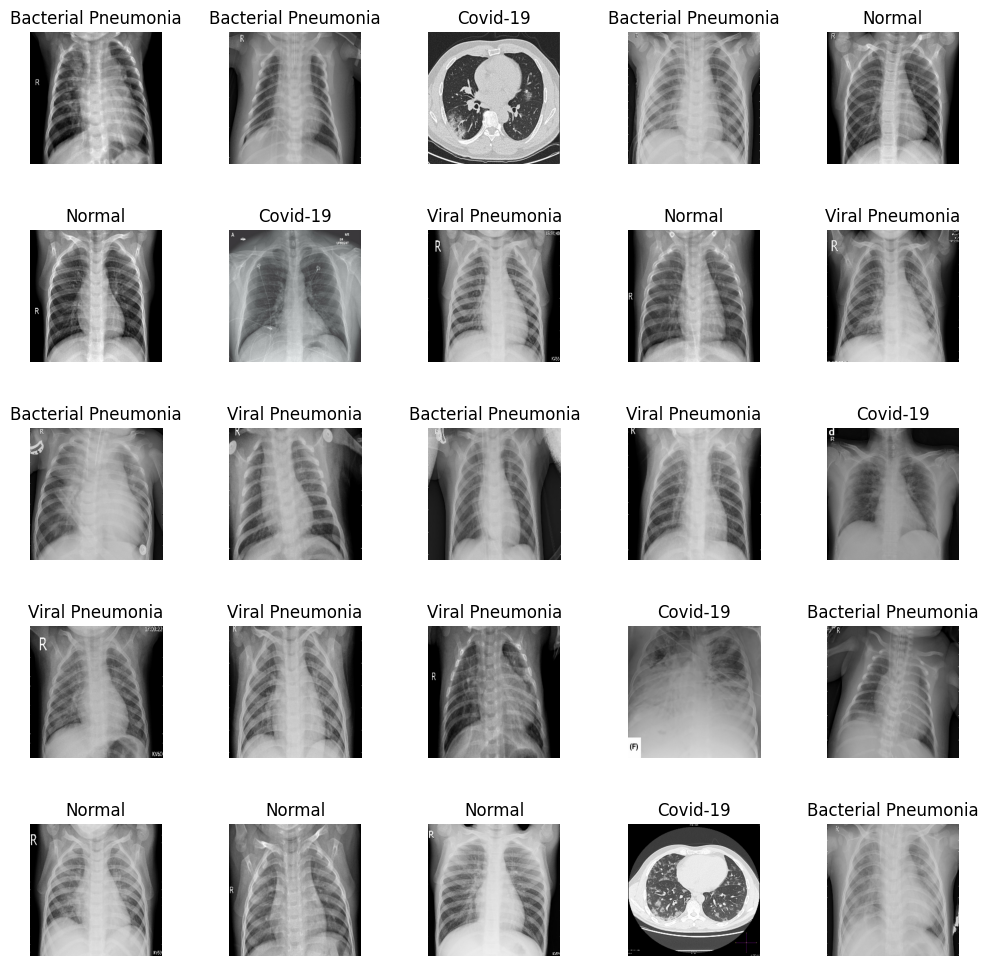

---

### Средние изображения по классам (grayscale)

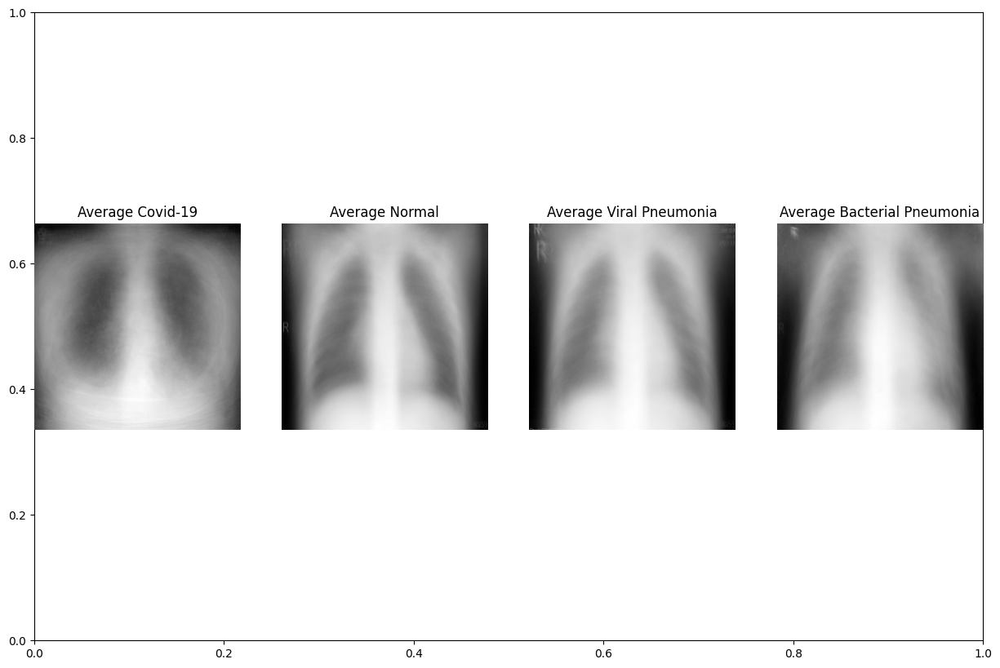

**Covid-19** - характерные диффузные матовые затемнения в нижних долях.  
**Normal** - чёткие симметричные лёгочные поля, хорошо выраженные рёбра.  
**Viral и Bacterial Pneumonia** - визуально очень похожи, что и является главной сложностью задачи.

---

### Распределение соотношений сторон (width / height)

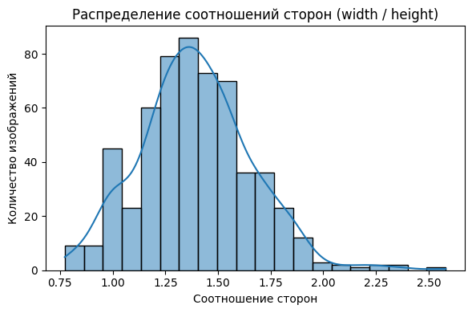

Большинство снимков имеют соотношение сторон **1.25–1.50** (альбомная ориентация). Разброс от 0.75 до 2.60 - изображения имеют разные размеры, поэтому необходим единый ресайз перед обучением.

---

##  Preprocessing

### CLAHE (Contrast Limited Adaptive Histogram Equalization)
```python
lab = cv2.cvtColor(image, cv2.COLOR_RGB2LAB)
clahe = cv2.createCLAHE(clipLimit=2.5, tileGridSize=(8, 8))
# применяется к каналу L → LAB → RGB
```
Улучшает локальный контраст рентгеновских снимков без переосветления глобального яркого фона.

### MixUp аугментации

**Model 1 - глобальный MixUp (все классы):**
```python
def mixup_batch(images, labels, alpha=0.4):
    lam = max(np.random.beta(alpha, alpha), 1 - lam)

train_gen = mixup_generator(train_gen_base, alpha=0.2)
```

**Model 3 - Selective MixUp (только классы 2 и 3):**
```python
def selective_mixup_batch(images, labels, target_classes=(2, 3), alpha=0.1):
    # смешиваем только Viral/Bacterial Pneumonia

train_gen_eff_mix = selective_mixup_generator(
    train_gen_eff_base, target_classes=(2, 3), alpha=0.3
)
```

### Grad-CAM
```python
last_conv_layer_name = "conv5_block3_out"
overlay_gradcam_on_image(img, heatmap, alpha=0.4)
# Примечание: во всех трёх Grad-CAM блоках используется model1 (ResNet50)
```

---

##  Модели

### Model 1 - ResNet50 + CLAHE + MixUp (global, α=0.2)

```python
base = ResNet50(weights="imagenet", include_top=False,
                input_tensor=Input(shape=(224, 224, 3)))

for layer in base.layers[:-30]:   # заморожены все кроме последних 30
    layer.trainable = False

MaxPooling2D(pool_size=(4, 4))
Flatten()
Dense(256, relu, l2=1e-4) → Dropout(0.4)
Dense(128, relu, l2=1e-5) → Dropout(0.3)
Dense(4, softmax, l2=1e-5)

optimizer = RMSprop(learning_rate=3e-5, decay=1e-6)
EarlyStopping(monitor="val_loss", patience=12, restore_best_weights=True)
epochs=13  →  сохраняется в Xray_model.keras
```

### Model 2 - EfficientNetB0 + Fine-tune (без MixUp)

**Phase 1:**
```python
for layer in base_eff2.layers[:-10]:   # заморожены все кроме последних 10
    layer.trainable = False

MaxPooling2D(pool_size=(4, 4))
Flatten()
Dense(256, relu) → Dropout(0.4)
Dense(128, relu) → Dropout(0.3)
Dense(4, softmax)

optimizer = RMSprop(learning_rate=1e-4, decay=1e-6)
EarlyStopping(patience=12)
epochs=25  →  effb0_model_v2.keras
```

**Phase 2 - Fine-tuning:**
```python
N = 40
for layer in base_eff2.layers[-N:]:
    layer.trainable = True   # размораживаем последние 40 слоёв

optimizer = RMSprop(learning_rate=1e-5)   # без decay
EarlyStopping(patience=7)
epochs=10  →  effb0_model_v2_finetuned.keras
```

### Model 3 - EfficientNetB0 + Selective MixUp (классы 2 и 3, α=0.3)

```python
for layer in base_eff.layers[:-30]:   # заморожены все кроме последних 30
    layer.trainable = False

MaxPooling2D()   # без pool_size — дефолтный
Flatten()
Dense(256, relu) → Dropout(0.4)
Dense(128, relu) → Dropout(0.3)
Dense(4, softmax)

optimizer = RMSprop(learning_rate=1e-5)   # без decay
EarlyStopping(monitor="val_loss", patience=15, restore_best_weights=True)
epochs=30  →  covid_effb0_mixup.keras
```

---

##  Результаты

### Model 1 - ResNet50: История обучения (13 эпох)

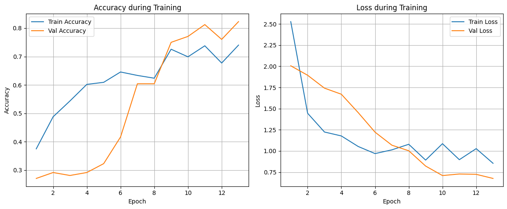

| Метрика | Train | Test |
|---|---|---|
| Accuracy | 0.8462 | **0.8125** |
| Loss | 0.4953 | 0.9064 |

---

### Model 1 - ResNet50: Confusion Matrix


| Класс | Precision | Recall | F1 | Support |
|---|---|---|---|---|
| 0 Covid-19 | 0.83 | 1.00 | 0.91 | 10 |
| 1 Normal | 0.71 | 1.00 | 0.83 | 10 |
| 2 Viral Pneum. | 1.00 | 0.40 | **0.57** | 10 |
| 3 Bacterial Pneum. | 1.00 | 1.00 | 1.00 | 2 |
| **accuracy** | | | **0.81** | 32 |
| macro avg | 0.89 | 0.85 | 0.83 | 32 |
| weighted avg | 0.86 | 0.81 | 0.79 | 32 |

---

### Model 1 - ResNet50: Неверные предсказания (всего: 6)

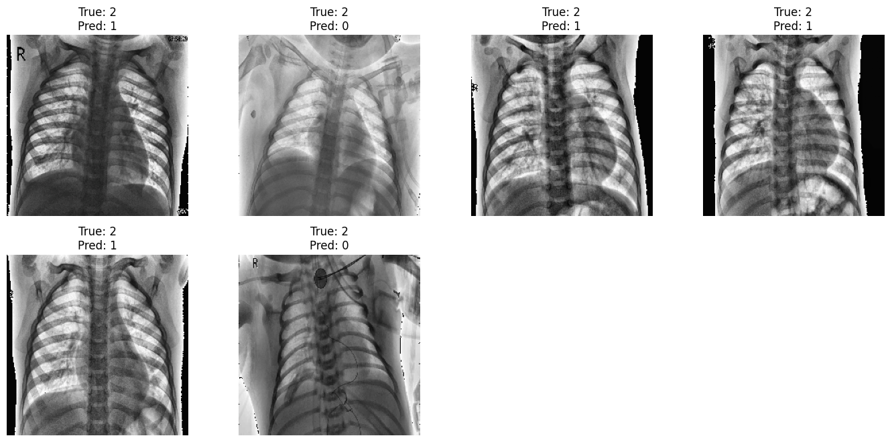

Все 6 ошибок - класс **2 (Viral Pneumonia)**: предсказан как 0 (Covid) или 1 (Normal). Визуально снимки действительно неотличимы без дополнительных анализов.

---

### Model 1 - Grad-CAM (`conv5_block3_out`)

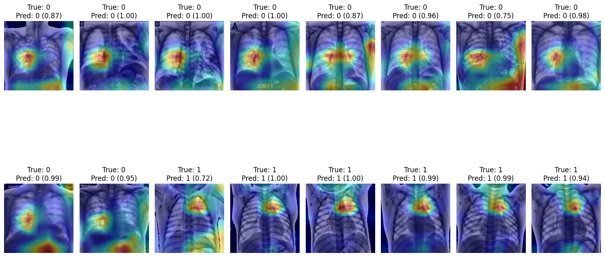

Тепловые карты показывают, что модель фокусируется на центральных структурах лёгких и сердечно-сосудистой области — клинически осмысленные зоны.

---

### Model 2 - EfficientNetB0: История обучения (Phase 1: 25 эпох)

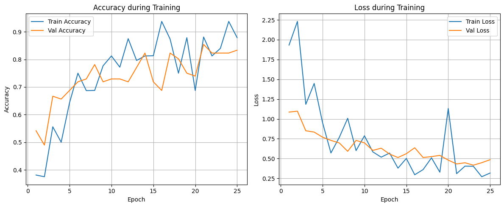

| Метрика | Train | Test (после fine-tune) |
|---|---|---|
| Accuracy | 0.9856 | **0.875** |
| Loss | — | 0.4861 |

---

### Model 2 - EfficientNetB0: Confusion Matrix (после fine-tune)

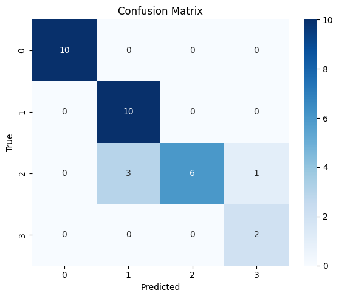

| Класс | Precision | Recall | F1 | Support |
|---|---|---|---|---|
| 0 Covid-19 | 1.00 | 1.00 | 1.00 | 10 |
| 1 Normal | 0.77 | 1.00 | 0.87 | 10 |
| 2 Viral Pneum. | 1.00 | 0.60 | **0.75** | 10 |
| 3 Bacterial Pneum. | 0.67 | 1.00 | 0.80 | 2 |
| **accuracy** | | | **0.88** | 32 |
| macro avg | 0.86 | 0.90 | 0.85 | 32 |
| weighted avg | 0.91 | 0.88 | 0.87 | 32 |

---

### Model 2 - EfficientNetB0: Неверные предсказания (всего: 6)

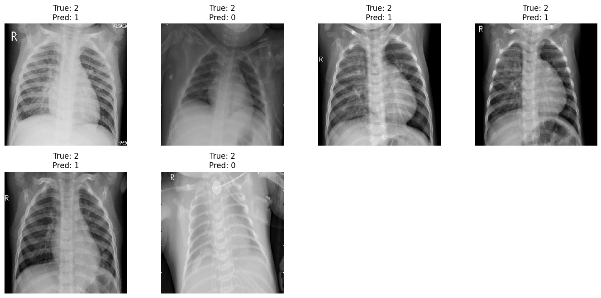

Снова все ошибки - класс **2 (Viral Pneumonia)**, спутан с классами 0 и 1.

---

### Model 2 - Grad-CAM (EfficientNetB0, слой `conv5_block3_out`, model1)

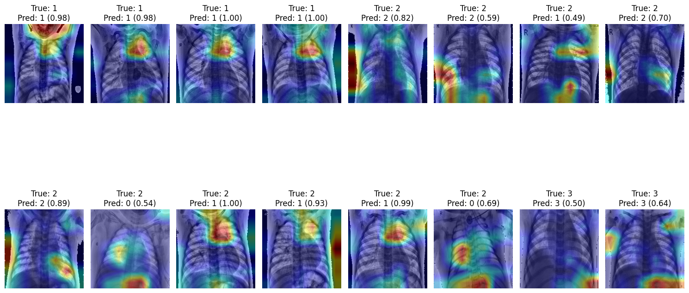

---

### Model 3 - EfficientNetB0 + Selective MixUp: История обучения (30 эпох)

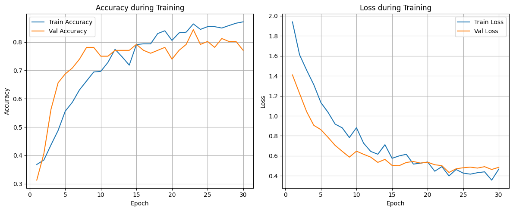

| Метрика | Train | Test |
|---|---|---|
| Accuracy | 0.9519 | **0.71875** |
| Loss | 0.1438 | 0.7325 |

---

### Model 3 - EfficientNetB0 + Selective MixUp: Confusion Matrix

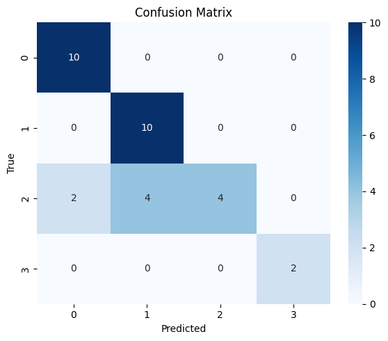

| Класс | Precision | Recall | F1 | Support |
|---|---|---|---|---|
| 0 Covid-19 | 0.83 | 1.00 | 0.91 | 10 |
| 1 Normal | 0.71 | 1.00 | 0.83 | 10 |
| 2 Viral Pneum. | 1.00 | 0.40 | **0.57** | 10 |
| 3 Bacterial Pneum. | 1.00 | 1.00 | 1.00 | 2 |
| **accuracy** | | | **0.81** | 32 |
| macro avg | 0.89 | 0.85 | 0.83 | 32 |
| weighted avg | 0.86 | 0.81 | 0.79 | 32 |

---

### Model 3 - EfficientNetB0 + Selective MixUp: Неверные предсказания (всего: 6)

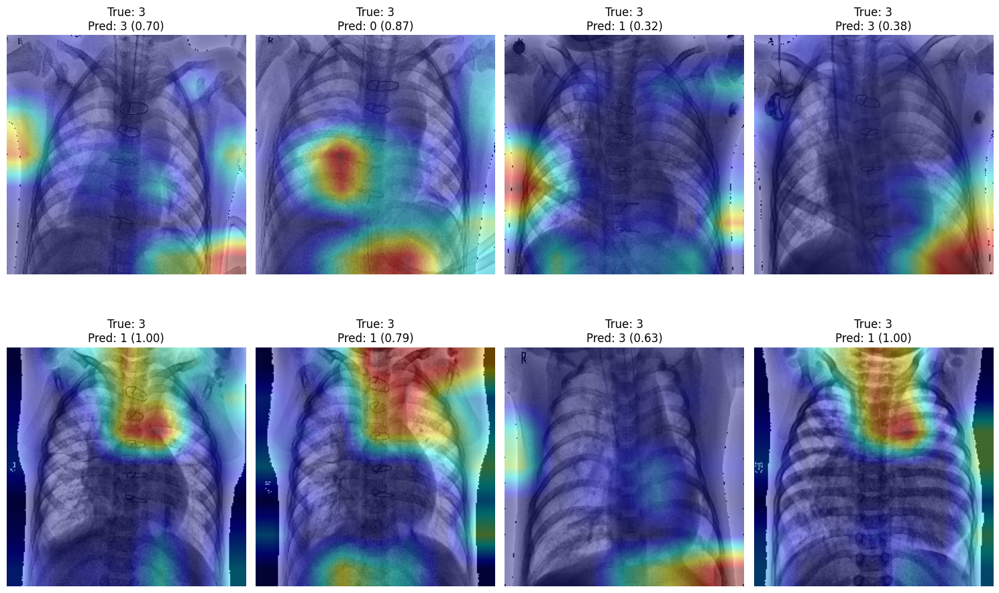

---

##  Сравнение всех моделей

| Модель | Разморожено | Epochs | lr | Train Acc | Test Acc | Viral F1 |
|---|---|---|---|---|---|---|
| ResNet50 + CLAHE + MixUp(α=0.2) | последние 30 | 13 | 3e-5 | 0.846 | 0.813 | 0.57 |
| EfficientNetB0 + Fine-tune | -10 → -40 | 25+10 | 1e-4 → 1e-5 | 0.986 | **0.875** | **0.75** |
| EfficientNetB0 + Selective MixUp(α=0.3) | последние 30 | 30 | 1e-5 | 0.952 | 0.719 | 0.57 |

---

##  Выводы

1. **Лучшая модель - EfficientNetB0 с Fine-tuning**: Test Accuracy **87.5%**, лучший F1 по Viral Pneumonia (**0.75** vs 0.57). Двухфазная стратегия - head при `lr=1e-4`, затем fine-tune последних 40 слоёв при `lr=1e-5` - дала наилучший результат.

2. **Covid-19 и Normal распознаются отлично** во всех моделях: F1 = 0.91 и 0.83-1.00 соответственно. Визуальные паттерны достаточно различимы.

3. **Viral и Bacterial Pneumonia - главная сложность**: все ошибки приходятся на класс 2 (Viral). Даже врачи-рентгенологи не могут надёжно разделить эти классы без дополнительных анализов (ПЦР, посев). Это фундаментальное ограничение задачи.

4. **Selective MixUp (Model 3) переобучился**: разрыв train/test = 23 п.п. (95% vs 72%). Датасет слишком мал (133 снимка на класс) для этой техники.

5. **Global MixUp (Model 1, ResNet50)** стабилен: разрыв train/test всего ~3 п.п. Более консервативный подход оказался надёжнее.

6. **Grad-CAM** (слой `conv5_block3_out`) подтверждает: модель фокусируется на клинически значимых областях лёгких, а не на артефактах. Во всех трёх блоках визуализации используется `model1` (ResNet50).

---

##  Стек технологий


```
tensorflow / keras  •  opencv (cv2)  •  numpy  •  pandas
matplotlib  •  seaborn  •  Pillow  •  scikit-learn

ResNet50  •  EfficientNetB0  •  ImageDataGenerator
CLAHE (clipLimit=2.5, tileGridSize=8×8)
MixUp (global α=0.2)  •  Selective MixUp (classes 2&3, α=0.3)
Grad-CAM (conv5_block3_out, overlay α=0.4)
Transfer Learning  •  Fine-tuning  •  EarlyStopping  •  ModelCheckpoint
```

---

